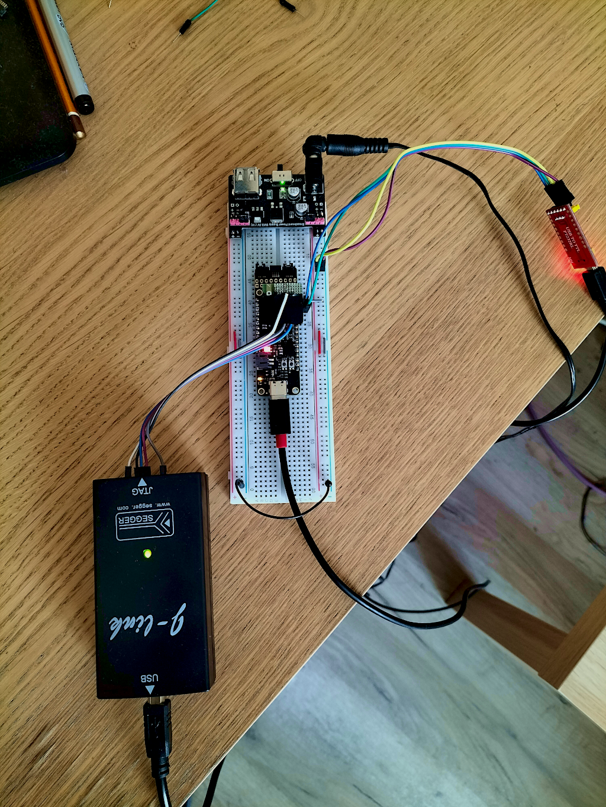

# Getting acquainted with `F4PGA` fully open source toolchain for the development of FPGAs

F4PGA is a fully open source toolchain for the development of FPGAs of multiple
vendors. Currently, it targets the Xilinx 7-Series, Lattice iCE40, Lattice ECP5
FPGAs, QuickLogic EOS S3 and is gradually being expanded to provide a comprehensive
end-to-end FPGA synthesis flow

## How it works

Here is a short introduction to how `F4PGA` works [How F4PGA works](https://f4pga.readthedocs.io/en/latest/how.html)

## What FPGA architectures are currently supported

Here is a list of supported architectures: [Supported architectures](https://f4pga.readthedocs.io/en/latest/status.html)

## Installation of `F4PGA` toolchain

The entire toolchain installation was done according to the tutorial on the project
site: [F4PGA toolchain installation](https://f4pga-examples.readthedocs.io/en/latest/getting.html)

## Build examples for `Quicklogic EOS S3 SoC`

Before building the example, make sure you have the environment variables exported
with the installation directories:

```bash
export F4PGA_INSTALL_DIR=~/opt/f4pga
```

where `~/opt/f4pga` is catalog in which `f4pag` was installed.

```bash
export FPGA_FAM="eos-s3"
```

Next step is preparing the environment:

```bash
source "$F4PGA_INSTALL_DIR/$FPGA_FAM/conda/etc/profile.d/conda.sh"
```

After this step we can activate the environment:

```bash
conda activate $FPGA_FAM
```

Then go to the directory with examples:

```bash
cd eos-s3
```

and fianally we invoke build:

```bash
make -C btn_counter
```

after make is invoked, a summary of the phases of the synthesis and routing process
is displayed:

```bash
Project status:
    [S] bitstream:  bitstream -> /home/bofh/F4PGA/f4pga-examples/eos-s3/btn_counter/build/top.bit
    [O] build_dir:  /home/bofh/F4PGA/f4pga-examples/eos-s3/btn_counter/build
    [S] eblif:  synth -> /home/bofh/F4PGA/f4pga-examples/eos-s3/btn_counter/build/top.eblif
    [S] fasm:  fasm -> /home/bofh/F4PGA/f4pga-examples/eos-s3/btn_counter/build/top.fasm
    [S] fasm_extra:  synth -> /home/bofh/F4PGA/f4pga-examples/eos-s3/btn_counter/build/top_fasm_extra.fasm
    [S] io_place:  ioplace -> /home/bofh/F4PGA/f4pga-examples/eos-s3/btn_counter/build/top.ioplace
    [S] net:  pack -> /home/bofh/F4PGA/f4pga-examples/eos-s3/btn_counter/build/top.net
    [O] pcf:  /home/bofh/F4PGA/f4pga-examples/eos-s3/btn_counter/chandalar.pcf
    [S] place:  place -> /home/bofh/F4PGA/f4pga-examples/eos-s3/btn_counter/build/top.place
    [S] place_constraints:  place_constraints -> /home/bofh/F4PGA/f4pga-examples/eos-s3/btn_counter/build/top_constraints.place
    [S] route:  route -> /home/bofh/F4PGA/f4pga-examples/eos-s3/btn_counter/build/top.route
    [S] sdc:  prepare_sdc -> /home/bofh/F4PGA/f4pga-examples/eos-s3/btn_counter/build/top.sdc
    [O] sdc-in:  /home/bofh/F4PGA/f4pga-examples/eos-s3/btn_counter/dummy.sdc
    [O] sources:  ['/home/bofh/F4PGA/f4pga-examples/eos-s3/btn_counter/btn_counter.v']

```

After each phase is completed, a summary is displayed (for example):

```bash
Executing module `yosys`:
    [1/3] : Synthesizing sources: ['/home/bofh/F4PGA/f4pga-examples/eos-s3/btn_counter/btn_counter.v']...
Module `yosys` has finished its work!

```

After completing all phases, the configuration file for the FPGA chip (bit or bin)
will be created and we can load it to the SoC `EOS S3` using `J-Link`or `openOCD`



## Build examples for `Xilinx Artix-7 FPGA`

In this case, the first four steps are similiar to these from the `EOS S3` example
(to activate the `conda` environment ):

```bash
export F4PGA_INSTALL_DIR=~/opt/f4pga
```

where `~/opt/f4pga` is catalog in which `f4pag` was installed.

```bash
export FPGA_FAM="xc7"
```

Next step is preparing the environment:

```bash
source "$F4PGA_INSTALL_DIR/$FPGA_FAM/conda/etc/profile.d/conda.sh"
```

After this step we can activate the environment:

```bash
conda activate $FPGA_FAM
```

Then go to the directory with examples:

```bash
cd xc7
```

and fianally we invoke build:

```bash
TARGET="arty_35" make -C counter_test
```

As one can see the target in this case is `Arty 35` FPGA board: [Arty 35 FPGA board](https://www.xilinx.com/products/boards-and-kits/arty.html)

As the FPGA configuration file (bit or bin) is created, we can load it into the
FPGA set with the command:

```bash
TARGET="arty_35" make download -C counter_test
```

Alternatively, we can use the `openFPGALoader` application to load the FPGA
configuration file:

```bash
openFPGALoader -b arty_a7_35t top.bit
```

Here is link to `openFPGALoader`application: [openFPGALoader Github](https://github.com/trabucayre/openFPGALoader)

## What next

If someone would like to have a broader view of the entire toolchain, I recommend reading a very good tutorial [F4PGA open source flow](<https://antmicro.com/blog/2022/09/f4pga-new-build-system-and-cli-tool/>)
