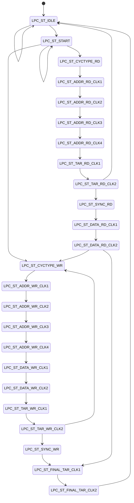
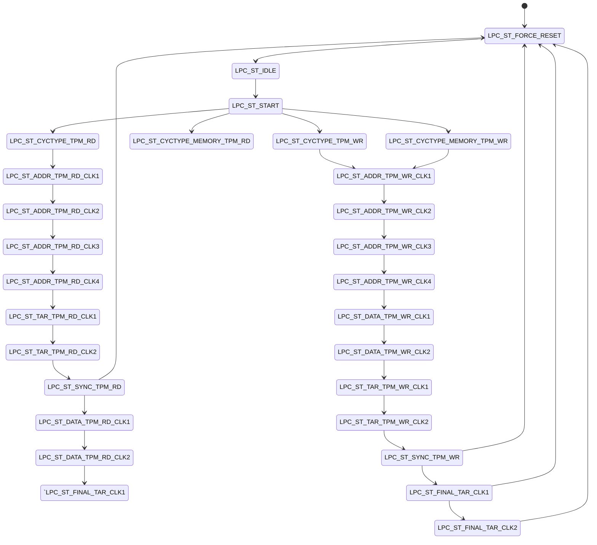

# Finite state machines for LPC peripheral and host

### LPC Peripheral FSM state diagram:

```mermaid
stateDiagram-v2
    [*] --> LPC_ST_IDLE
    LPC_ST_IDLE --> LPC_ST_IDLE
    LPC_ST_IDLE --> LPC_ST_START
    LPC_ST_START --> LPC_ST_START
    LPC_ST_START --> LPC_ST_CYCTYPE_RD
    LPC_ST_START --> LPC_ST_CYCTYPE_WR
     LPC_ST_CYCTYPE_RD --> LPC_ST_ADDR_RD_CLK1
    LPC_ST_CYCTYPE_WR --> LPC_ST_ADDR_WR_CLK1
    LPC_ST_ADDR_WR_CLK1 --> LPC_ST_ADDR_WR_CLK2
    LPC_ST_ADDR_WR_CLK2 --> LPC_ST_ADDR_WR_CLK3
    LPC_ST_ADDR_WR_CLK3 --> LPC_ST_ADDR_WR_CLK4
    LPC_ST_ADDR_WR_CLK4 --> LPC_ST_DATA_WR_CLK1 
    LPC_ST_DATA_WR_CLK1 --> LPC_ST_DATA_WR_CLK2
    LPC_ST_DATA_WR_CLK2 --> LPC_ST_TAR_WR_CLK1
    LPC_ST_TAR_WR_CLK1 --> LPC_ST_TAR_WR_CLK2
    LPC_ST_TAR_WR_CLK2 --> LPC_ST_CYCTYPE_WR
    LPC_ST_TAR_WR_CLK2 --> LPC_ST_SYNC_WR
    LPC_ST_SYNC_WR --> LPC_ST_FINAL_TAR_CLK1

    LPC_ST_ADDR_RD_CLK1 --> LPC_ST_ADDR_RD_CLK2
    LPC_ST_ADDR_RD_CLK2 --> LPC_ST_ADDR_RD_CLK3
    LPC_ST_ADDR_RD_CLK3 --> LPC_ST_ADDR_RD_CLK4
    LPC_ST_ADDR_RD_CLK4 --> LPC_ST_TAR_RD_CLK1
    LPC_ST_TAR_RD_CLK1  --> LPC_ST_TAR_RD_CLK2
    LPC_ST_TAR_RD_CLK2 -->  LPC_ST_IDLE
    LPC_ST_TAR_RD_CLK2 --> LPC_ST_SYNC_RD
    LPC_ST_SYNC_RD --> LPC_ST_DATA_RD_CLK1
    LPC_ST_DATA_RD_CLK1 --> LPC_ST_DATA_RD_CLK2
    LPC_ST_DATA_RD_CLK2 --> LPC_ST_CYCTYPE_WR
    LPC_ST_DATA_RD_CLK2 --> LPC_ST_FINAL_TAR_CLK1 
    LPC_ST_FINAL_TAR_CLK1 --> LPC_ST_FINAL_TAR_CLK2
    LPC_ST_FINAL_TAR_CLK2 --> LPC_ST_IDLE
```
### LPC Host FSM state diagram:

```mermaid
stateDiagram-v2
    [*] --> LPC_ST_FORCE_RESET
    LPC_ST_FORCE_RESET --> LPC_ST_IDLE
    LPC_ST_IDLE --> LPC_ST_START
    LPC_ST_START --> LPC_ST_CYCTYPE_TPM_RD
    LPC_ST_START --> LPC_ST_CYCTYPE_TPM_WR
    LPC_ST_START --> LPC_ST_CYCTYPE_MEMORY_TPM_RD
    LPC_ST_START --> LPC_ST_CYCTYPE_MEMORY_TPM_WR

    LPC_ST_CYCTYPE_TPM_RD --> LPC_ST_ADDR_TPM_RD_CLK1
    LPC_ST_ADDR_TPM_RD_CLK1 --> LPC_ST_ADDR_TPM_RD_CLK2
    LPC_ST_ADDR_TPM_RD_CLK2 --> LPC_ST_ADDR_TPM_RD_CLK3
    LPC_ST_ADDR_TPM_RD_CLK3 --> LPC_ST_ADDR_TPM_RD_CLK4
    LPC_ST_ADDR_TPM_RD_CLK4 --> LPC_ST_TAR_TPM_RD_CLK1
    LPC_ST_TAR_TPM_RD_CLK1 --> LPC_ST_TAR_TPM_RD_CLK2
    LPC_ST_TAR_TPM_RD_CLK2 --> LPC_ST_SYNC_TPM_RD
    LPC_ST_SYNC_TPM_RD --> LPC_ST_DATA_TPM_RD_CLK1
    LPC_ST_SYNC_TPM_RD --> LPC_ST_FORCE_RESET
    LPC_ST_DATA_TPM_RD_CLK1 --> LPC_ST_DATA_TPM_RD_CLK2
    LPC_ST_DATA_TPM_RD_CLK2 --> `LPC_ST_FINAL_TAR_CLK1

    LPC_ST_CYCTYPE_TPM_WR --> LPC_ST_ADDR_TPM_WR_CLK1
    LPC_ST_CYCTYPE_MEMORY_TPM_WR --> LPC_ST_ADDR_TPM_WR_CLK1
    LPC_ST_ADDR_TPM_WR_CLK1 --> LPC_ST_ADDR_TPM_WR_CLK2
    LPC_ST_ADDR_TPM_WR_CLK2 --> LPC_ST_ADDR_TPM_WR_CLK3
    LPC_ST_ADDR_TPM_WR_CLK3 --> LPC_ST_ADDR_TPM_WR_CLK4
    LPC_ST_ADDR_TPM_WR_CLK4 --> LPC_ST_DATA_TPM_WR_CLK1
    LPC_ST_DATA_TPM_WR_CLK1 --> LPC_ST_DATA_TPM_WR_CLK2
    LPC_ST_DATA_TPM_WR_CLK2 --> LPC_ST_TAR_TPM_WR_CLK1 
    LPC_ST_TAR_TPM_WR_CLK1  --> LPC_ST_TAR_TPM_WR_CLK2
    LPC_ST_TAR_TPM_WR_CLK2 --> LPC_ST_SYNC_TPM_WR
    LPC_ST_SYNC_TPM_WR --> LPC_ST_FINAL_TAR_CLK1
    LPC_ST_SYNC_TPM_WR --> LPC_ST_FORCE_RESET

    LPC_ST_FINAL_TAR_CLK1 --> LPC_ST_FORCE_RESET
    LPC_ST_FINAL_TAR_CLK1 --> LPC_ST_FINAL_TAR_CLK2
    LPC_ST_FINAL_TAR_CLK2 --> LPC_ST_FORCE_RESET
```

