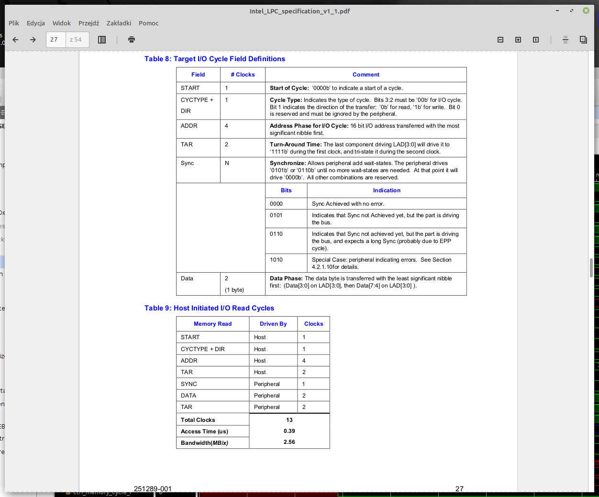
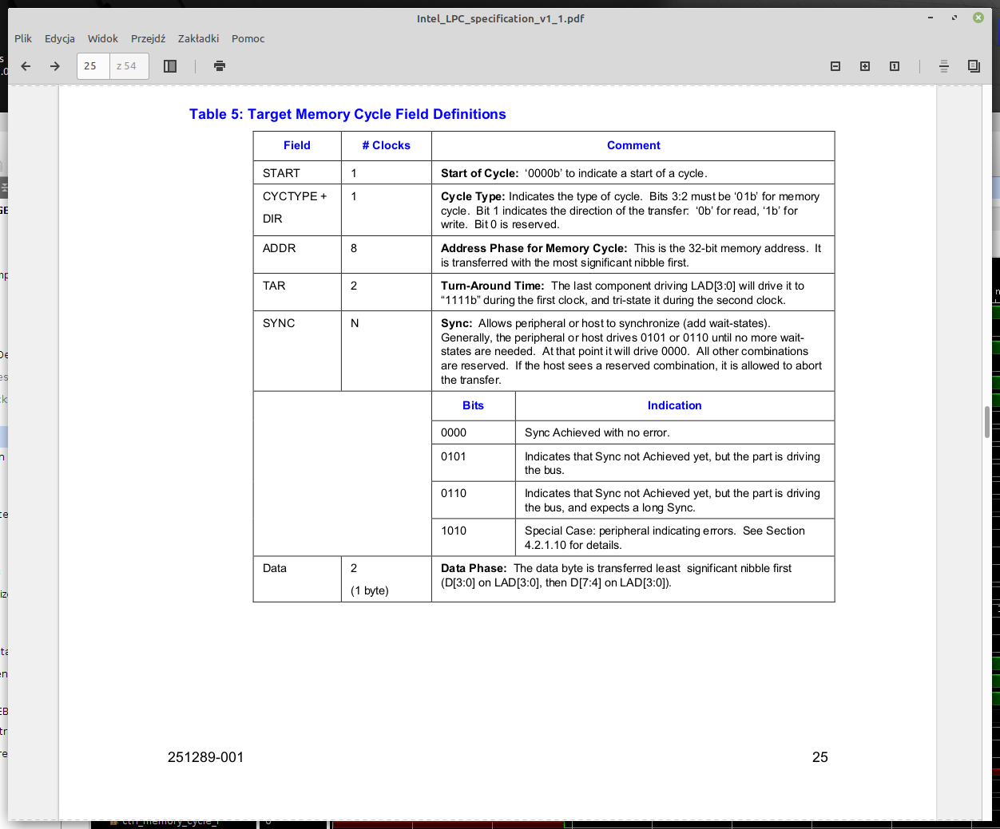
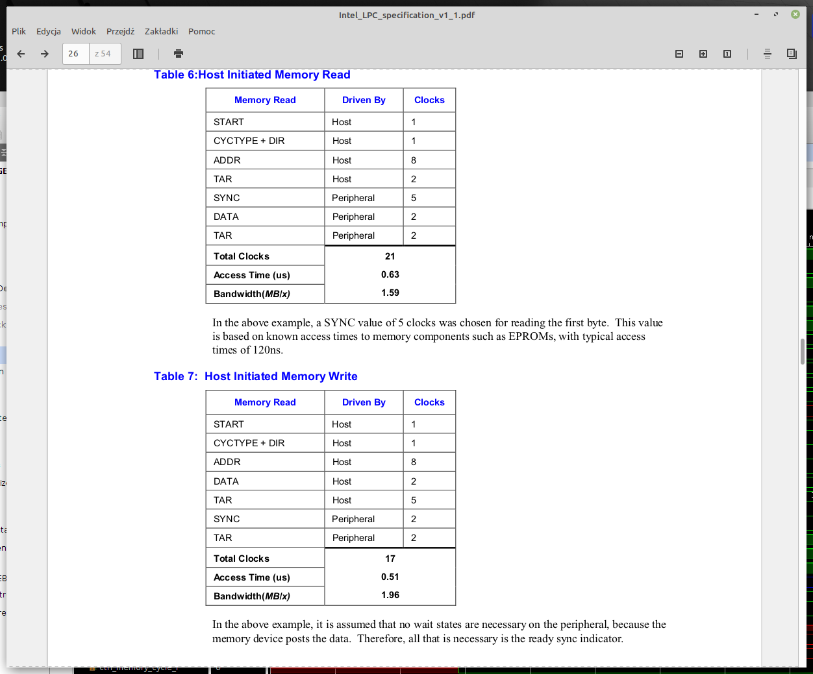
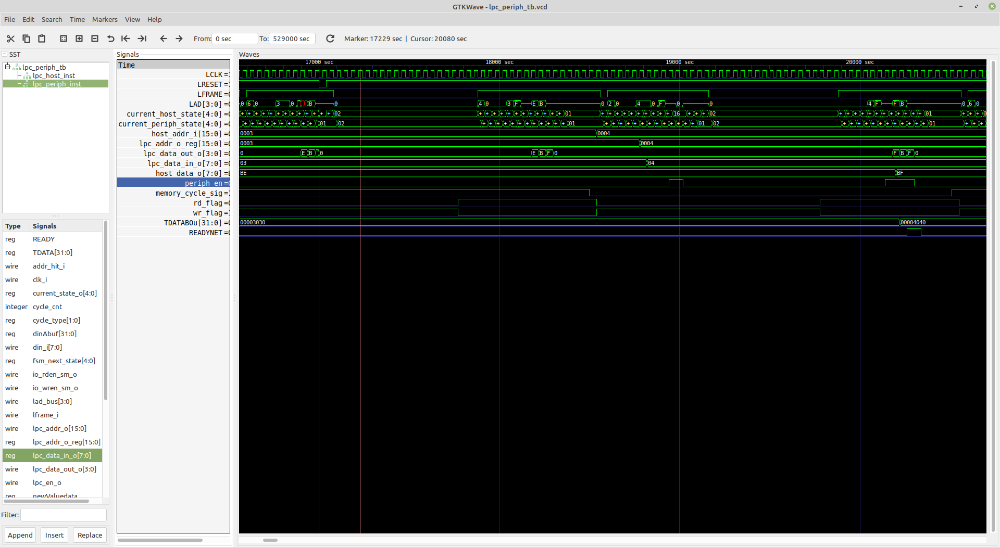
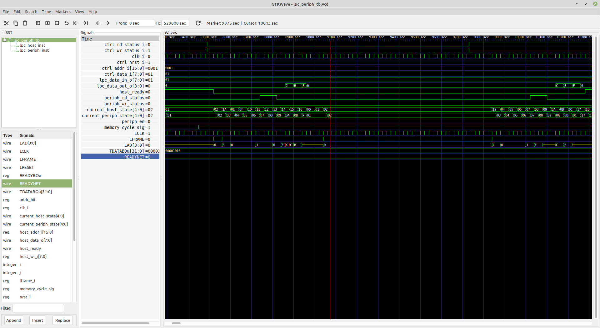
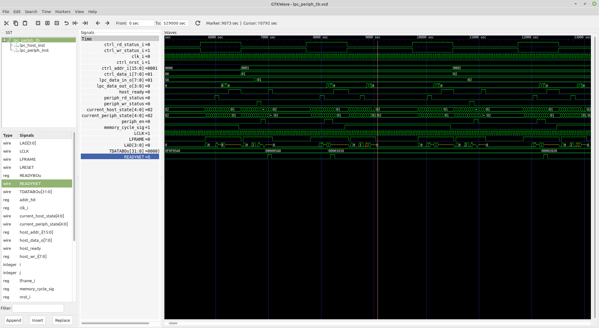

## Why do we need to support additional LPC protocol cycles in "LPC Host"

In the implementation of the LPC (LPC Host and LPC Peripheral) protocol we wrote
earlier, only two types of LPC cycles were supported:
+ I/O cycles (Read and Write)
+ TPM cycles

And we really do not need to support more types of LPC cycles in the designed 
TPM module, but there is a need to check how the "LPC peripheral" module we wrote
reacts to other types of cycles appearing on the 4-bit LAD bus. For this purpose,
it was necessary to extend LPC Host implementation with additional LPC protocol
cycle types. 

The "LPC peripheral" module should record all the occurrences on the LAD of the
I/O and TPM cycles and send their data (LPC address and LPC data) to the 
MCU module of SoC (by 32-bit output bus in FPGA). However, other LPC protocol cycle
types on the LAD bus should be ignored and their data should not be logged.

It is enough to add one additional type of supported cycles to the `LPC Host`
module as the response of the "LPC Peripheral" to all additional cycle types 
should be similar. The choice fell on Memory Read/Write cycles because they are
quite similar to `I/O` cycles and easy to implement.

## Changes related to the addition of "Memory" cycles support in "LPC Host"

First, let's look at the similarities and differences between the I/O and memory
cycles. For this purpose we will look at Intel's [LPC Protocol](https://www.intel.com/content/dam/www/program/design/us/en/documents/low-pin-count-interface-specification.pdf) reference document.
See screen shots from this document. First we have description of I/O cycles


The most important here are the `START` and `CYCTYPE` fields:

+ START has value: 0000b
+ CYCTYPE has values: 0000b or 0010b
And we also see that whole I/O cycle has a length of 13 clock cycles.

Second we have description of Memory cycles:




The most important here are also the `START` and `CYCTYPE` fields:

+ START has value: 0000b
+ CYCTYPE has values: 0100b or 0110b
And we also see that whole `Memory R/W` cycle has a length of 21 (read) or 17 (write)
clock cycles. The field Address on LAD bus is longer compared to `I/O` cycles.

## Changes in the "LPC Host" implementation regarding the handling of `Memory R/W` cycles

1. First, we added the `ctrl_memory_cycle_i` input signal to the `lpc_host` port 
list - see in code:
```verilog

`include "lpc_defines.v"

module lpc_host (clk_i, ctrl_addr_i, ctrl_data_i, ctrl_nrst_i, ctrl_lframe_i,
                 ctrl_rd_status_i, ctrl_wr_status_i, ctrl_memory_cycle_i,
                 ctrl_data_o, ctrl_ready_o, ctrl_host_state_o,
                 LPC_LAD, LPC_LCLK, LPC_LRESET, LPC_LFRAME
);

    input  wire        clk_i;

    // Control signals are used to drive the control the LPC host.
    // Control signals (input)
    input  wire [15:0] ctrl_addr_i;
    input  wire [ 7:0] ctrl_data_i;
    input  wire        ctrl_nrst_i;
    input  wire        ctrl_lframe_i;
    input  wire        ctrl_rd_status_i;
    input  wire        ctrl_wr_status_i;
    input  wire        ctrl_memory_cycle_i; // 1- means Memory cycle, 0 - means I/O cycle

    // Control signals (output)
    output reg  [ 7:0] ctrl_data_o;
    output reg         ctrl_ready_o;
    output wire [ 4:0] ctrl_host_state_o;

    // LPC Host Interface
    inout  wire [ 3:0] LPC_LAD;
    output wire        LPC_LCLK;
    output reg         LPC_LRESET;
    output reg         LPC_LFRAME;
```
2. Secondly, in the `LPC_ST_START` phase of the LPC cycle (FSM machine), depending
   on the state of the `ctrl_memory_cycle_i` input (high state means Memory cycle),
   we changed the value of the CYCTYPE field on the LAD bus to the one appropriate
   for the `Memory` cycle - see code:

```verilog
      else if (fsm_host_state == `LPC_ST_START) begin
           if (~ctrl_memory_cycle_i) begin
                if (ctrl_lframe_i & ctrl_rd_status_i) begin
                    LPC_LFRAME  = 1;
                    lad_out = 4'b0000;
                    fsm_host_state = `LPC_ST_CYCTYPE_RD;
                end
                else if (ctrl_lframe_i & ctrl_wr_status_i) begin
                    LPC_LFRAME  = 1;
                    lad_out = 4'b0010;
                    fsm_host_state = `LPC_ST_CYCTYPE_WR;
                end
           end  if (ctrl_memory_cycle_i) begin
                if (ctrl_lframe_i & ctrl_rd_status_i) begin
                    LPC_LFRAME  = 1;
                    lad_out = 4'b0100;
                    fsm_host_state = `LPC_ST_CYCTYPE_MEMORY_RD;
                end
                else if (ctrl_lframe_i & ctrl_wr_status_i) begin
                    LPC_LFRAME  = 1;
                    lad_out = 4'b0110;
                    fsm_host_state = `LPC_ST_CYCTYPE_MEMORY_WR;
                end
           end
        end
```
3. Third, changes in two places in the FSM code - starting the memory cycles:

```verilog
. . .
     else if ((fsm_host_state == `LPC_ST_CYCTYPE_RD) || (fsm_host_state == `LPC_ST_CYCTYPE_MEMORY_RD)) begin 

            lad_out = ctrl_addr_i[15:12];
            fsm_host_state = `LPC_ST_ADDR_RD_CLK1;
        end
. . .
        else if ((fsm_host_state == `LPC_ST_CYCTYPE_WR) || (fsm_host_state == `LPC_ST_CYCTYPE_MEMORY_WR)) begin
            lad_out = ctrl_addr_i[15:12];
            fsm_host_state = `LPC_ST_ADDR_WR_CLK1;
        end
. . .
```

## Changes in the "LPC Peripheral" implementation regarding skipping of LPC cycles different than `I/O` or `TPM`

+  First, one internal signal has been added:

```verilog
reg skipCycle;               // 1 -indicates that this cycle is not I/O or TPM cycle, 0 - indicates I/O or TPM cycle
```
+ On the main state machine (FSM) supporting LPC cycles - states `LPC_ST_IDLE`
and` LPC_ST_START` were modified:

```verilog
        case(current_state_o)
            `LPC_ST_IDLE:
             begin
                 skipCycle <= 1'b0;
                 if (nrst_i == 1'b0) fsm_next_state <= `LPC_ST_IDLE;
                 else if ((lframe_i == 1'b0) && (lad_bus == 4'h0)) fsm_next_state <= `LPC_ST_START;
             end
             `LPC_ST_START:
              begin
                  if ((lframe_i == 1'b0) && (lad_bus == 4'h0)) fsm_next_state <= `LPC_ST_START;
                  else if ((lframe_i == 1'b1) && (lad_bus != 4'h0) && (lad_bus != 4'h2)) skipCycle = 1'b1;
                  else if ((lframe_i == 1'b1) && (lad_bus == 4'h0)) fsm_next_state <= `LPC_ST_CYCTYPE_RD;
                  else if ((lframe_i == 1'b1) && (lad_bus == 4'h2)) fsm_next_state <= `LPC_ST_CYCTYPE_WR;                
              end
```
When in the `LPC_ST_START` state, the LAD bus does not have a CYCTYPE meaning I/O
or `Memory` cycles, the `skipCycle` signal becomes High.

+ In the rest of the code, the value of the `lpc_en_o` signal is worked out already
using the signal state of the `skipCycle`

```verilog
   assign lpc_en_o = ((!skipCycle)&&(sync_en == 1'b1)) ? 1'h1 :
                      ((!skipCycle)&&(tar_F == 1'b1 )) ? 1'h1 :
                      (lframe_i == 1'b0 ) ? 1'h0 :
                      ((!skipCycle)&&(rd_data_en[0] == 1'b1)) ? 1'b1 :
                      ((!skipCycle)&&(rd_data_en[1] == 1'b1)) ? 1'b1 :
                      1'h0;
```
This causes LPC cycle data not to be recorded on the output bus for cycles other
 than I/O and TPM.

## Changes in the `test bench` implementation regarding the handling of `Memory R/W` cycles

+ In the test bench, firstly we added `memory_cycle_sig` to the list of internal
  signals of the `lpc_periph_tb` module:
 
```verilog
    reg  [15:0] u_addr;    //auxiliary host addres
    reg   [7:0] u_data;    //auxiliary host data
    integer i, j;
    reg memory_cycle_sig;
```
+ Second, to the main loop sending the cycle data to module `lpc_host` we add 
   second for loop for setting `memory_cycle_sig` signal value. In this way, the
 I/O and memory cycles are alternately sent:

```verilog
       for (i = 0; i <= 128; i = i + 1) begin
          for(j = 0; j < 2; j = j + 1) begin
            memory_cycle_sig = j; //Cycle type: Memory or I/O
            // Perform write
            #40  lframe_i  = 0;
            rd_flag = 0;
            wr_flag  = 1;
            host_addr_i = u_addr+i;
            host_wr_i  = u_data+i;
            #40 lframe_i = 1;
            #400 lframe_i = 0;
. . .
```
## The results of the simulation of the `lpc-periph` module in Xilinx vivado 2019.1

First, we will look at the simulation of the `lpc_periph` module for I/O cycles:



As you can see in the screenshot from Icarus Verilog (simulation) - the value of
signal `memory_cycle_sig` is Low, meaning the `I/O` cycle. At the point marked 
with a vertical (pink) line, the output bus signal `TDATABOu [31:0]` is changed
to the values sent by the LPC Host and the pulse (high state) of the `READYNET`
signal is generated (which means that there are new data on output bus). Also signal
`periph_en`(High) is generated. The states of the FSM machines for LPC Host
and `LPC Peripheral` are also important - you can see that here the FSM machine
states from peripheral mimics these from host. It means that, complete `I/O`
cycles are performed by `LPC Peripheral`.

In the second screenshot we can see what the signals for the `Memory` cycle look
like:


Signal `memory_cycle_sig` has High value this time. In the time slot marked with 
a vertical (pink) line you can see that the `LPC Peripheral` do not generate 
`periph_en`(High) signal. The state of the LAD bus is then 0x6 in CYCTYPE field
which means the `Memory` cycle. Because signal `periph_en` hadn't been generated
the cycle data sent by Host is not registered on output bus `TDATABOu [31:0]` nor
`READYNET` signal was generated. Such `LPC Peripheral` reaction is expected - in 
this case during the execution of the `Memory` cycle registering cycle data is 
skipped.

Now let's look at the third simulation screenshot:



We can also observe on the last simulation screenshot that while the state of 
the `memory_cycle_sig` signal is high (`Memory` cycle) there is never a change in the
state of the output bus `TDATABOu [31: 0]`. Signal `periph_en` (High) is also never
generated when `memory_cycle_sig` signal is high. Such behavior of `LPC Peripheral` 
was expected before simulating the `LPC pripheral` operation - `I/O` cycles should 
be recorded, other cycle types should be ignored.


