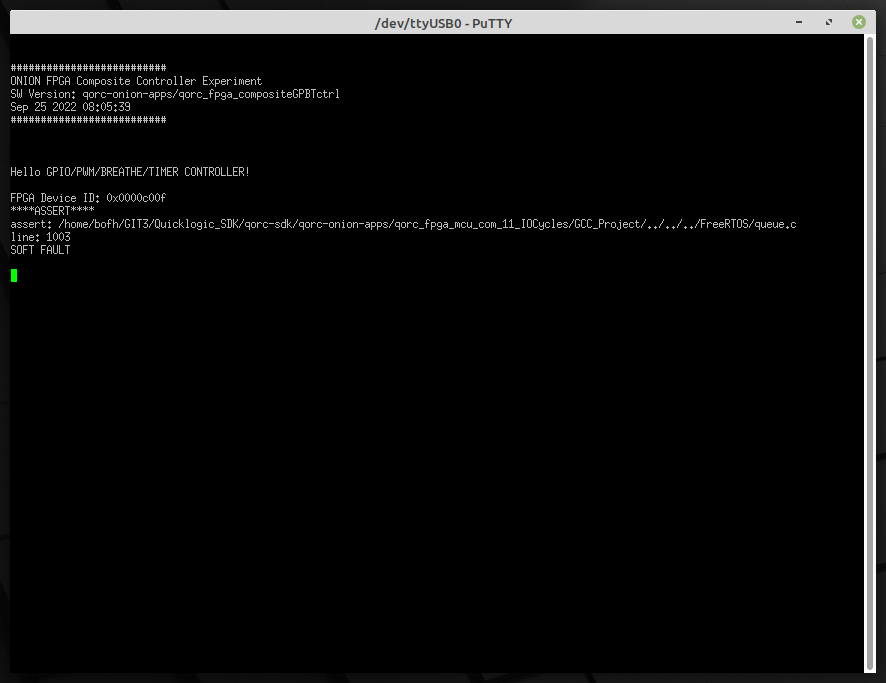
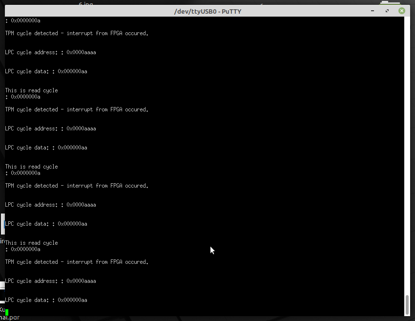

## "LPC Peripheral" implementation test on real hardware (FPGA boards)

### What do we want to test and how

In the implementation of the LPC protocol (LPC Host and LPC Peripheral) protocol we wrote  earlier, only two types of LPC cycles were supported:
+ I / O cycles (Read and Write)
+ TPM cycles

And we really do not need to support more types of LPC cycles in the designed 
TPM module, but there is a need to check how the "LPC peripheral" module we wrote
reacts to other types of cycles appearing on the 4-bit LAD bus. 

The "LPC peripheral" module should record all the occurrences on the LAD of the
`I/O` and `TPM` cycles and send their data (LPC address and LPC data) to the 
MCU module of SoC (by 32-bit output bus in FPGA). However, other LPC protocol cycle types on the LAD bus should be ignored and their data should not be logged.

### What hardware resources will be needed for the test and what is the configuration of the test circuit

Generally speaking, the test circuit consists of three FPGA boards including auxiliary circuits (like clock generator). The test system consists of the following hardware modules:

+ Arduino UNO with aplication controlling the PLL module (SiS5351) by I2C bus
+ Hardware PLL module (SiS5351) conncted to Arduino board by I2C bus
+ CmodA7 FPGA board (with Xilinx Artix-7 FPGA) with application of `LPC Host Manager`
+ QMTECH Spartan-7 FPGA board with application of `LPC Host`
+ Target `Quicklogic Thing Plus` board (EOS S3 SoC) with application of "LPC  
Peripheral"
+ two pieces of `Xilinx Cable` JTAG programmer/debbuger
+ `SEGGER J-Link` JTAG programmer/debbuger
+ needed wiring
+ logic analyzer

Here is a simple diagram showing how the hardware modules are connected:


and here is picture of test circuit:


### Software components used in the test

Here is short list of used software components:

+ Application for Arduino UNO which uses the I2C bus to control the hardware PLL 
loop system (SiS5351)
+ `LPC Host Manager` (on CmodA7 FPGA board) generates the control signals needed 
in the test scenario for the LPC Host module
+ `LPC Host` (on Spartan-7 FPGA board) generates LPC protocol (LAD bus) cycles 
and control signals
+ Target application (FPGA + MCU ARM Cortex-M4) on the `EOS S3` SoC board which is using` LPC Peripheral` as submodule

### Brief description of the operation of the test system

The PLL circiut controlled by the Arduino UNO program generates a square-wave signal
with a frequency of 33 MHz. This signal is the clock (input) for the first FPGA 
(CmodA7). In the CmodA7 chip it is buffered (output buffer) and is a clock for 
the rest of the test circuit. On the first  FPGA board, a simple application
is implemented to send control signals for the next FPGA module with the 
implementation of `LPC Host`. Here is VHDL code of this module:
```vhdl
LIBRARY IEEE;
USE IEEE.STD_LOGIC_1164.ALL;
USE IEEE.NUMERIC_STD.ALL;

ENTITY LPC_Host_Manager IS
	PORT (
		clk33MHz           : IN STD_LOGIC; --33 ns okres
		reset              : IN STD_LOGIC;
		LRESET_IN          : OUT STD_LOGIC;
		LFRAME_IN          : OUT STD_LOGIC;
		Address            : OUT STD_LOGIC_VECTOR (15 DOWNTO 0);
		Data_IN            : OUT STD_LOGIC_VECTOR(7 DOWNTO 0);
		IO_Read_status     : OUT STD_LOGIC;
		IO_Write_status    : OUT STD_LOGIC;
		Ctrl_Memory_cycle  : OUT STD_LOGIC;
		clk33MHzOut        : OUT STD_LOGIC;
		ERROR              : OUT STD_LOGIC -- Podlaczony do LED - swieci to blad
	);
END LPC_Host_Manager;

ARCHITECTURE Behavioral OF LPC_Host_Manager IS

	SIGNAL licznik : unsigned(18 DOWNTO 0) := b"0000000000000000000"; -- definicja syg lokalnego
	SIGNAL Memory_cycle_sig : STD_LOGIC := '0'; -- 1 - Memory cycle, 0 - I/O cycle

BEGIN
	clk33MHzOut <= clk33MHz;
	Ctrl_Memory_cycle <= Memory_cycle_sig;

	SEQ : PROCESS (clk33MHz, reset) --20 ns okres
	BEGIN
		IF (reset = '1') THEN
			licznik <= b"0000000000000000000";
			Memory_cycle_sig <= '0';
		ELSIF (clk33MHz'EVENT AND clk33MHz = '1') THEN 
			IF ((licznik >= 0) AND (licznik < 4)) THEN
				licznik <= licznik + 1;
				-- Initialize
				ERROR <= '0';
				LFRAME_IN <= '1'; 
				LRESET_IN <= '1'; 
				IO_Read_status <= '0'; 
				IO_Write_status <= '1';
				Address <= "1010101010101010"; 
				Data_IN <= "10101010"; 
			ELSIF ((licznik >= 4) AND (licznik < 8)) THEN
				licznik <= licznik + 1;
				LRESET_IN <= '0';
			ELSIF ((licznik >= 8) AND (licznik < 33)) THEN 
				licznik <= licznik + 1;
				LRESET_IN <= '1';
			ELSIF ((licznik >= 33) AND (licznik < 37)) THEN
				licznik <= licznik + 1;
				-- Perform write
				IO_Read_status <= '0'; 
				IO_Write_status <= '1';
				Address <= "1111111100000001"; 
				Data_IN <= "01011010";
				LFRAME_IN <= '0'; 
			ELSIF ((licznik >= 37) AND (licznik < 41)) THEN
				licznik <= licznik + 1;
				LFRAME_IN <= '1';
			ELSIF ((licznik >= 41) AND (licznik < 121)) THEN
				licznik <= licznik + 1;
				-- Perform read
				IO_Read_status <= '1'; 
				IO_Write_status <= '0'; 
				Address <= "1111111111111111"; 
				Data_IN <= "10100111"; 
				LFRAME_IN <= '0'; 
			ELSIF ((licznik >= 121) AND (licznik < 129)) THEN
				licznik <= licznik + 1;
				LFRAME_IN <= '1';
			ELSIF ((licznik >= 129) AND (licznik < 133)) THEN
				licznik <= licznik + 1;
				-- Perform write
				IO_Read_status <= '0'; 
				IO_Write_status <= '1';
				Address <= "0000000011001100";
				Data_IN <= "11111111"; 
				LFRAME_IN <= '0'; 
			ELSIF ((licznik >= 133) AND (licznik < 137)) THEN
				licznik <= licznik + 1; 
				LFRAME_IN <= '1';
			ELSIF ((licznik >= 137) AND (licznik < 237)) THEN
				licznik <= licznik + 1;
			ELSIF (licznik >= 237) THEN
				licznik <= b"0000000000000000000";
				Memory_cycle_sig <= NOT Memory_cycle_sig;
				-- else 
				-- null;
			END IF;
		END IF;
	END PROCESS; -- SEQ:
 
END Behavioral;
```

The `LPC Host` is implemented on the second 
FPGA board with Spartan-7. `LPC Host` generates LPC protocol bus signals (LAD bus
and LFRAME, LRESET, LPC_Clock). Target board with SoC `EOS S3` is connected by 
LAD Bus (and control signals) to `LPC Host`. The `EOS S3 application filters the
cycle types appearing on the LAD bus, and if TPM or I O cycles are detected,
sends the cycle data (via internal Wishbone bus) to the SoC ARM MCU. Other types
of cycles are ignored. The MCU displays the received cycle data via UART.

### Running and debugging the test circuit

FPGA development kits were connected to external power supplies (those that required
them), the rest to the USB sockets of a PC with Linux OS. In order to program the
systems, the necessary programmers were connected to the USB sockets of the PC 
computer (Xilinx Cable and J-Link) . Individual FPGA sets were properly connected
with cabling. The individual FPGAs were then tested with a logic analyzer and any
errors found were removed. Here is screen-shot z układu `LPC Host`


Here is a brief description of the visible signals:
+ channels 0 - 3 LAD bus
+ channel 4 - LPC clock 33 MHz
+ channel 5 - LFrame
+ channel 6 - Reset
+ Channel 7 - not connected

As we can see - signals on LAD bus of `LPC Host` are proper. 
After launching `LPC Host`, we went on to test the target application on the 
`Quicklogic Thing Plus` board with SoC `EOS S3`. `EOS S3` (C ++ and Verilog) 
application code is available in this Github code repository:

[Github EOS S3 application](https://github.com/lpn-plant/lpntpm-eos-s3-examples)

After starting the whole system, we connected using the `Putty` application to
the UART (MCU Soc EOS S3). Unfortunately, the EOS S3 application has crashed with
software error:



This is an OS RTOS queue error caused by too fast issuing interrupts from the 
FPGA part of the Application. While testing the circuit, we found that if the 
FPGA interrupts come often than 30 µs, this error occurs. After the incoming LPC
cycles are programmatically slowed, the application displays the incoming cycle data



### Further work

As further work we should extend FPGA part by saving incoming LPC cycles to RAM 
(Block RAM in fpga structure) then sending data cycles to MCU with larger packets.
This way we avoid MCU application errpr related to frequent interrupt.