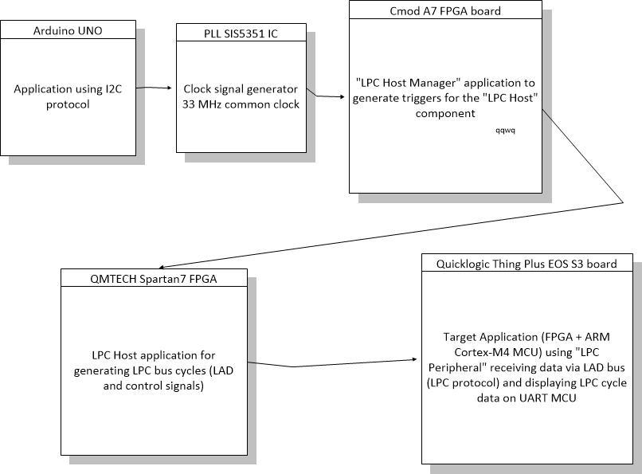
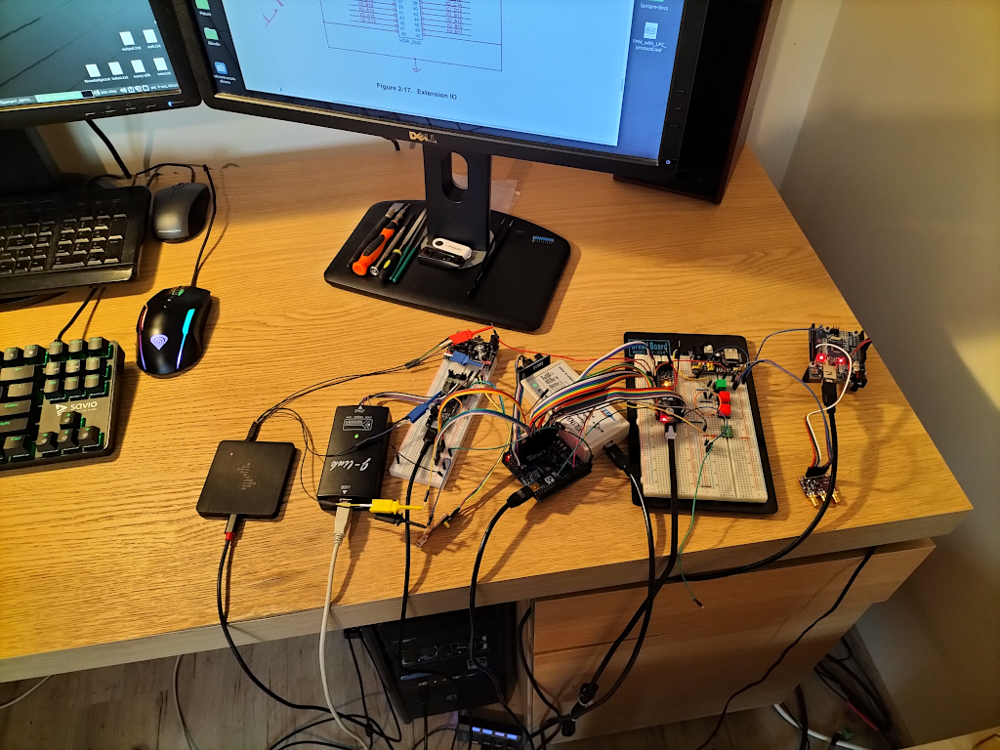

## "LPC Peripheral" implementation test on real hardware (FPGA boards)

### What do we want to test and how

In the implementation of the LPC protocol (LPC Host and LPC Peripheral) protocol we wrote  earlier, only two types of LPC cycles were supported:
+ I / O cycles (Read and Write)
+ TPM cycles

And we really do not need to support more types of LPC cycles in the designed 
TPM module, but there is a need to check how the "LPC peripheral" module we wrote
reacts to other types of cycles appearing on the 4-bit LAD bus. 

The "LPC peripheral" module should record all the occurrences on the LAD of the
`I/O` and `TPM` cycles and send their data (LPC address and LPC data) to the 
MCU module of SoC (by 32-bit output bus in FPGA). However, other LPC protocol cycle types on the LAD bus should be ignored and their data should not be logged.

### What hardware resources will be needed for the test and what is the configuration of the test circuit

Generally speaking, the test circuit consists of three FPGA boards including auxiliary circuits (like clock generator). The test system consists of the following hardware modules:

+ Arduino UNO with aplication controlling the PLL module (SiS5351) by I2C bus
+ Hardware PLL module (SiS5351) conncted to Arduino board by I2C bus
+ CmodA7 FPGA board (with Xilinx Artix-7 FPGA) with application of `LPC Host Manager`
+ QMTECH Spartan-7 FPGA board with application of `LPC Host`
+ Target `Quicklogic Thing Plus` board (EOS S3 SoC) with application of "LPC  
Peripheral"
+ two pieces of `Xilinx Cable` JTAG programmer/debbuger
+ `SEGGER J-Link` JTAG programmer/debbuger
+ needed wiring
+ logic analyzer

Here is a simple diagram showing how the hardware modules are connected:

and here is picture of test circuit:

### Software components used in the test

Here is short list of used software components:

+ Application for Arduino UNO which uses the I2C bus to control the hardware PLL 
loop system (SiS5351)
+ `LPC Host Manager` (on CmodA7 FPGA board) generates the control signals needed 
in the test scenario for the LPC Host module
+ `LPC Host` (on Spartan-7 FPGA board) generates LPC protocol (LAD bus) cycles 
and control signals
+ Target application (FPGA + MCU ARM Cortex-M4) on the `EOS S3` SoC board which is using` LPC Peripheral` as submodule

