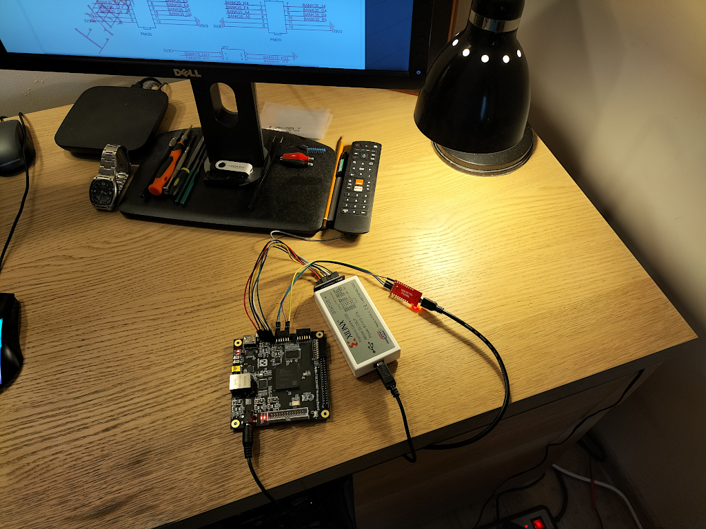
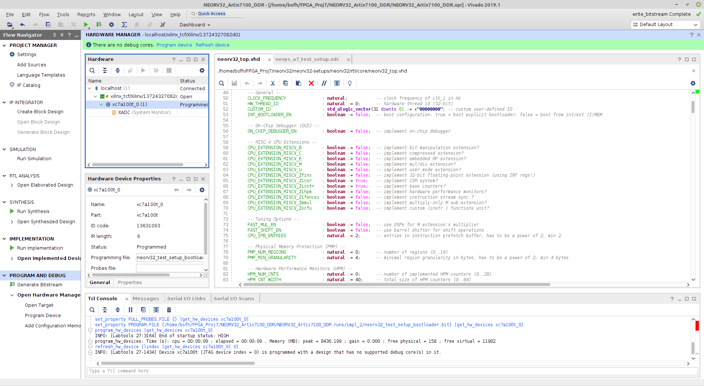

# Analysis of the TPM project launch on SoftCore-CPU

An alternative to hardware Hard-CPU (Or SoC containing Hard-CPU) is
SoftCore-CPU implemented from FPGA programmable circuit resources. This
solution, like any other, has its advantages, but also disadvantages - we will
try to describe them in this short document.

## Advantages

The main advantage of using SoftCore-CPU is its flexibility. We are able to
"sew" our CPU as needed, adding or omitting the appropriate blocks with HDL code
during synthesis. For example, if we don't need floating point calculations we
can omit FPU unit. For a further example if we need fast calculating checksums
we can add extension with hardware calculating of checksums (implemented in FPGA
fabric). By incurring programming costs, we can extend the set of peripheral
systems of such SoftCore-CPU. Another advantage is the possibility of
implementing SoftCore-CPU in a standard FPGA chip without Hard-CPU.

## Disadvantages

One of the main disadvantages is the lower performance of SoftCore-CPUs than
Hard-CPU. The SoftCore-CPU's main clock frequency is usually just a bit over 100
MHz. Also, the occupancy of both basic FPGA blocks, such as LUTs and Flip-Flops,
or more advanced ones, such as BRAM memory blocks or DSP blocks, is large.
Requirements for more complex SoftCore-CPUs can exceed 30K LUTs and several
thousand FFs. Therefore, it is necessary to select a large FPGA chip to
implement such a solution. The FPGA chip selected to implement SoftCore-CPU must
also be relatively fast.

There are also other limitations related to other aspects of the SoftCore-CPU
design. Often in SoftCore-CPU external RAM memory drivers are not implemented
(for example for DDR memory). There are also often limitations in some
programming tools for such SoftCore-CPU, such as bootloader or C/C++ compiler.

## SoftCore-CPU selection criteria

The SoftCore-CPU selection criteria for the hardware design of the TPM module
have been specified in previous documents - the most important of which are:

+ the existing driver for the external (in relation to FPGA) RAM memory for the
  CPU
+ The lower limit of the CPU RAM is 256 KB
+ 32-bit high-performance CPU
+ efficient system bus (preferably with 'burst' mode support)
+ fast interrupt controller
+ a big advantage would be a DMA controller with the possibility of transfers
  from BRAM FPGA memory to CPU RAM
+ flexible configuration options
+ flexible `bootloader` with the ability to boot RTOS and/or OS Linux
+ well-functioning toolchain - C compiler and loader
+ JTAG debbugger with `openOCD` support
+ complete and detailed documentation
+ sample programs showing how to use various soft-cpu modules
+ it would be an advantage if SoftCore-CPU could be fully synthesized in open
  source FPGA synthesis tools

## NEORV32

At this stage of work, we chose SoftCore-CPU named NEORV32 compatible with
32-bit RISC-V ISA. It happened because this project meets most of the
requirements set out in the paragraph above. One of the important factors was
the existing C++ compiler and the ability to debug CPU programs with the JTAG
debugger. The existence of the UART based `Bootloader` is also important. Also
the documentation for this project seems to be complete. The biggest
disadvantage of this particular SoftCore-CPU is the lack of an external DDR3
memory driver, which will have to be added to this processor. Problematic may
also be that this Soft-CPU was written in VHDL language and most open source
tools only support Verilog.

This project is available at [GitHub](https://github.com/stnolting/neorv32).

## Launching NEORV32

To familiarize ourselves with the NEORV32 project, we decided to run it on the
QMTECH FPGA board with the [Xilinx Artix-7 chip](https://pl.aliexpress.com/item/4000170042795.html?spm=a2g0o.productlist.0.0.50a757860ORVGM&algo_pvid=cda2307e-3949-4ae4-9ca0-1e6c960f5528&algo_exp_id=cda2307e-3949-4ae4-9ca0-1e6c960f5528-0&pdp_ext_f=%7B%22sku_id%22%3A%2212000029897527647%22%7D&pdp_npi=2%40dis%21PLN%21678.02%21678.02%21%21%2141.79%21%21%402100bddd16673770363786889e4a69%2112000029897527647%21sea&curPageLogUid=5KL1GZ3J6SMe)

On the website of the NEORV32 project, there were several configurations for
specific FPGAs from several FPGA manufacturers (Xilinx, Intel, Gowin)
[NEORV32 Setups](https://github.com/stnolting/neorv32-setups)
We chose a ready configuration for the Artix-7 FPGA (XC7A100T) because this is
the FPGA chip on the `QMTECH` development kit [NEORV32 Setups](https://github.com/stnolting/neorv32-setups/tree/main/vivado/nexys-a7-test-setup)
In order to create the project NEORV32 in Xilinx Vivado, it was necessary to
clone the project repository (with sub-modules) and use a ready-made script in
the TCL language:

```bash
git clone https://github.com/stnolting/neorv32-setups.git
git submodule init
git submodule update
```

Then you had to go to the subdirectory

```bash
cd /<neorv32 dir>/neorv32-setups/vivado/nexys-a7-test-setup
```

open Xilinx Vivado and in `TCL Console` issue command

```bash
source create_project.tcl
```

This TCL script created an entire Vivado project for an Artix-7 FPGA chip with
SoftCore-CPU implementation NEORV32 ready for synthesis.
Then we started in Vivado the synthesis, implementation and generation of the
bitstream for the project. Here is a photo of the test circuit:


Synthesis, implementation and generation of FPGA configuration file ended
without errors (there were some warnings):


Then, using the JTAG programmer/debugger (`Xilinx Cable`) we loaded the
configuration file into the FPGA set.
