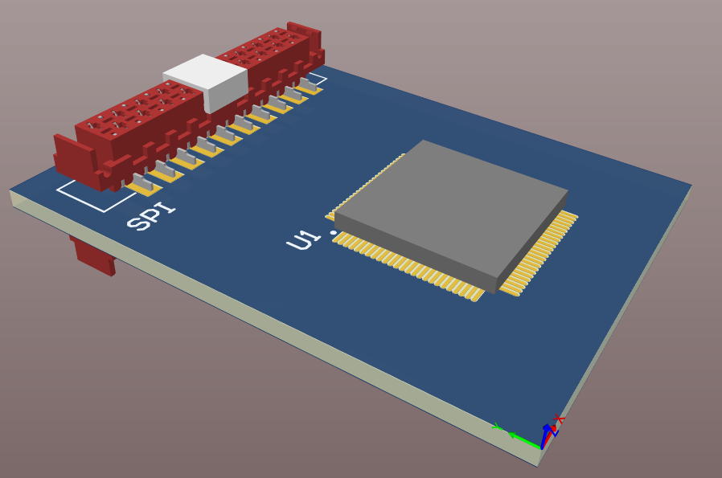
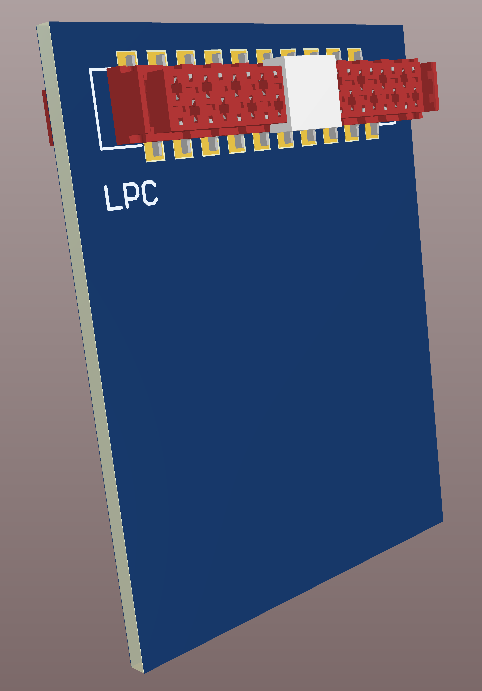
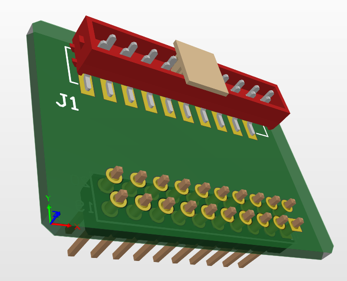
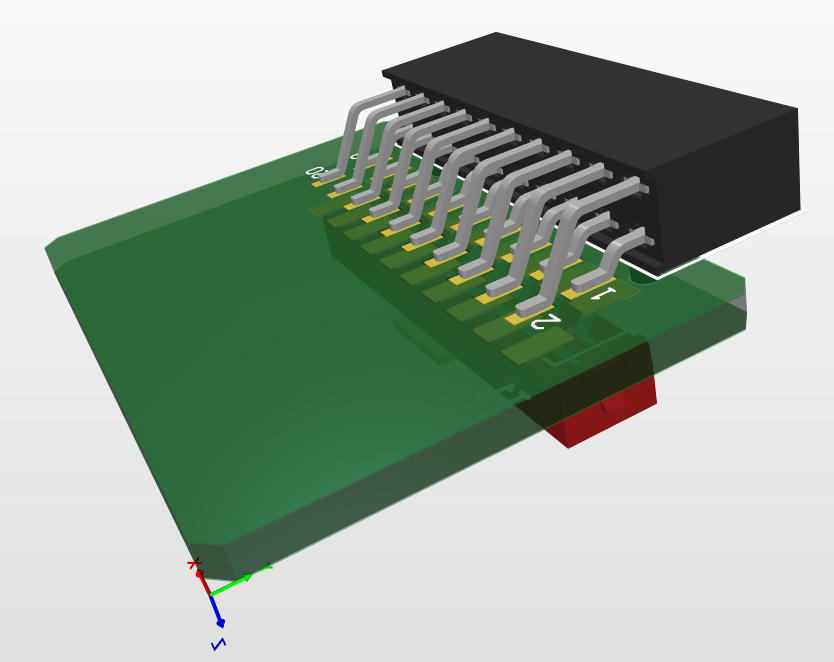
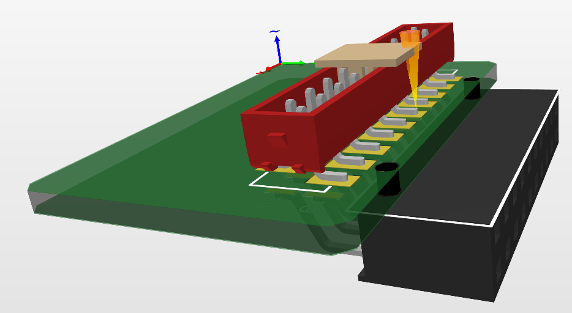
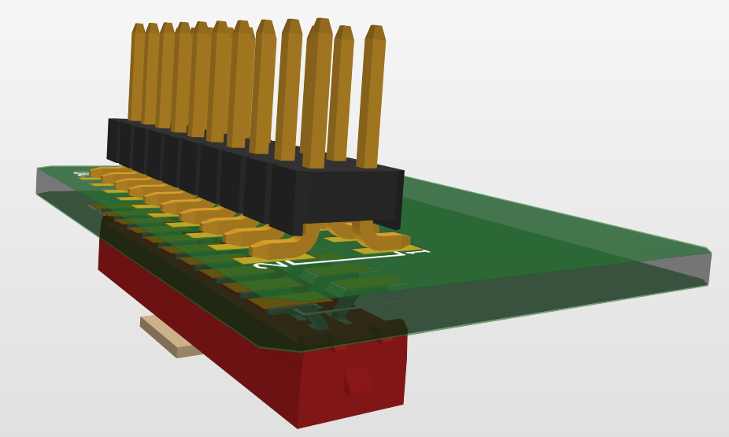
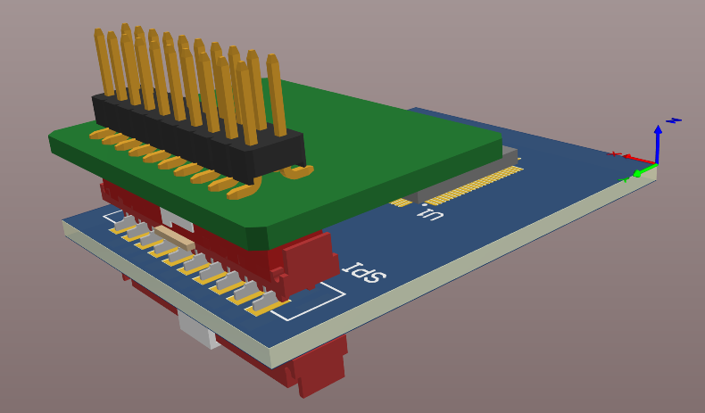
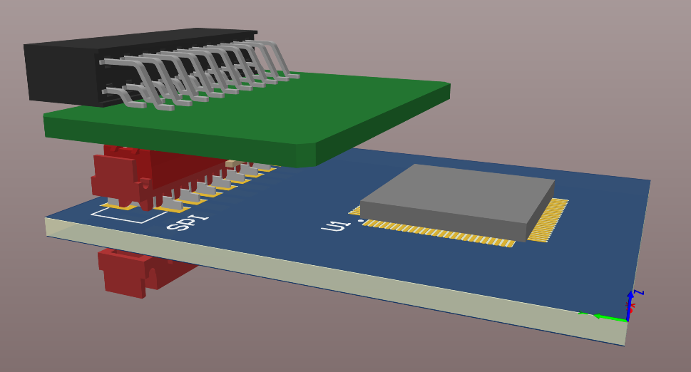
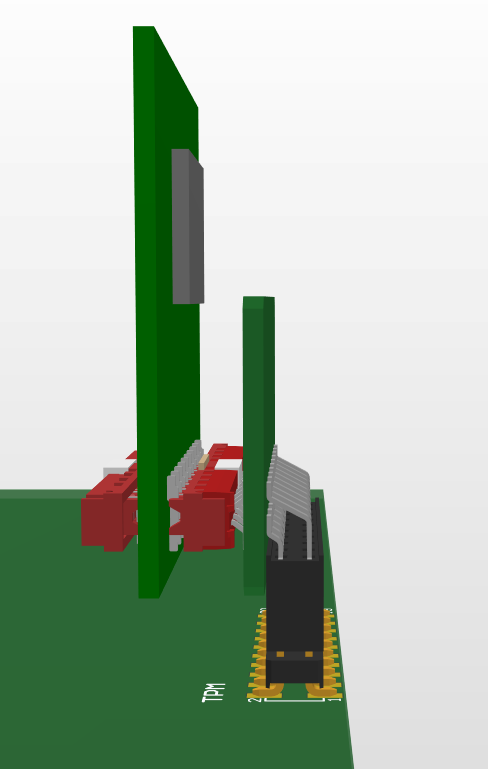
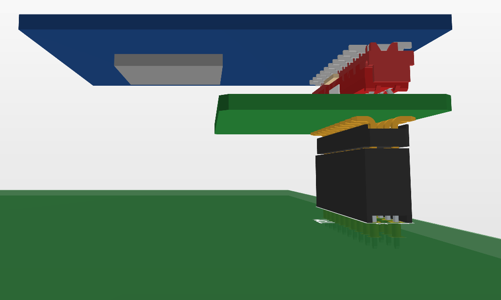

## The TPM concept
According to the many varied pinouts necessary was design the concept of TPM 
module which can fit the motherboard pinout. There was the consideration of 
two kinds of the interface (SPI and LPC). The whole setup would be made of two 
PCBs. One is the main PCB with the MCU and SPI or LPC configured socket and the 
second is the adapter that fits the motherboards pinouts.

## The main PCB
On the PCB there will be soldering only one chosen type of socket (SPI or LPC). 
This PCB will include the MCU, decoupling capacitors, and all necessary passive 
components.

## The adapter
This PCB is the second part to fit the SPI or LPC pinout to the motherboard 
pinouts. There will be created many variants (according to the pinout research) 
of adapters. We consider creating a straight and angled socket to be ready for
more existing mechanical design.

## Assembly
According to the adapter PCB, we consider a straight or angled connector. The 
size of PCBs is indicative.

{: style="height:425px"}

## Example of connection with motherboar

