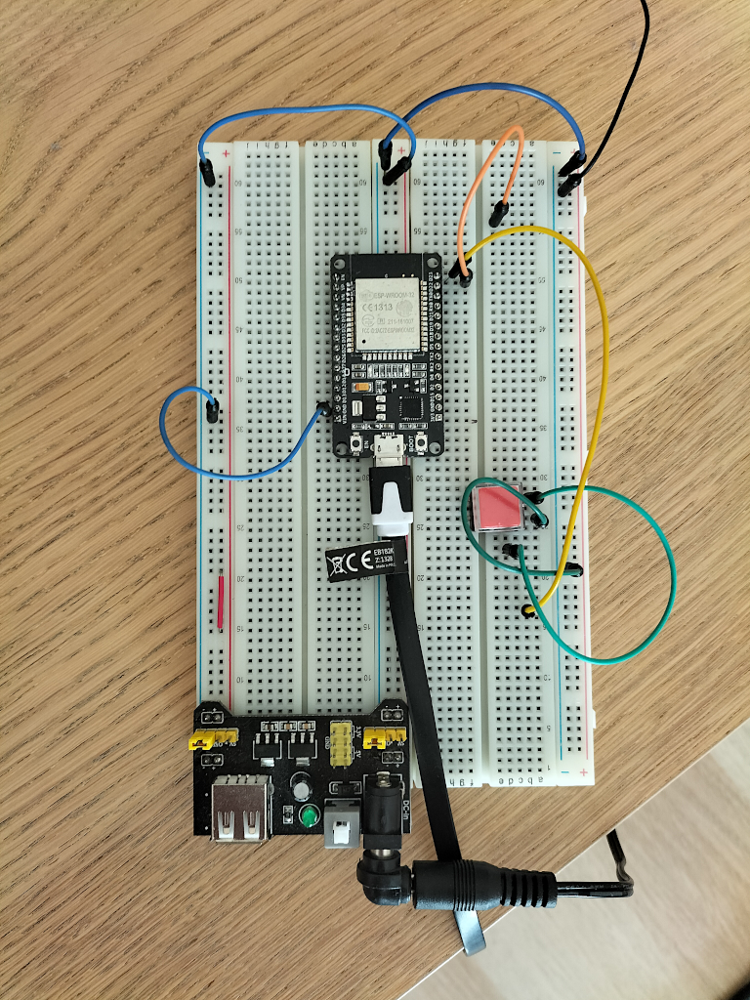
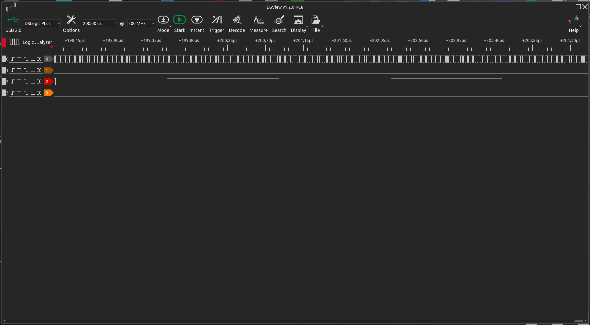
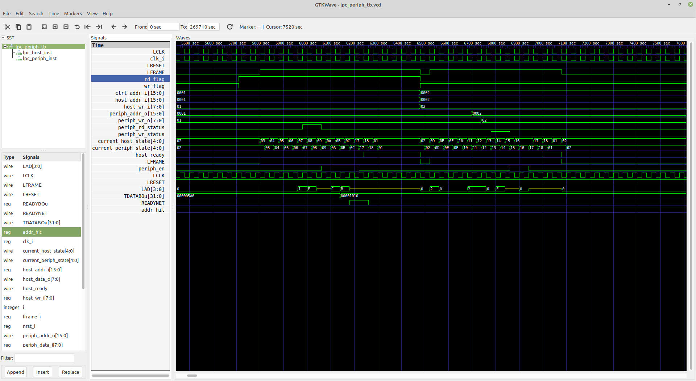
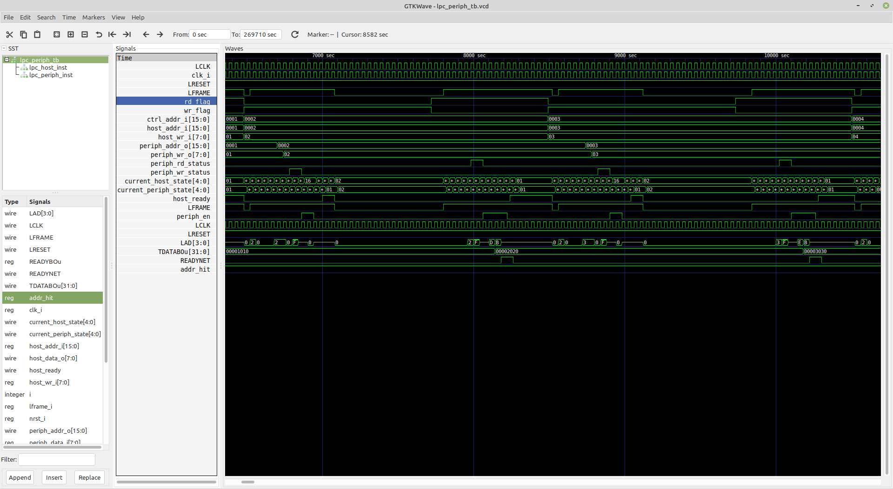
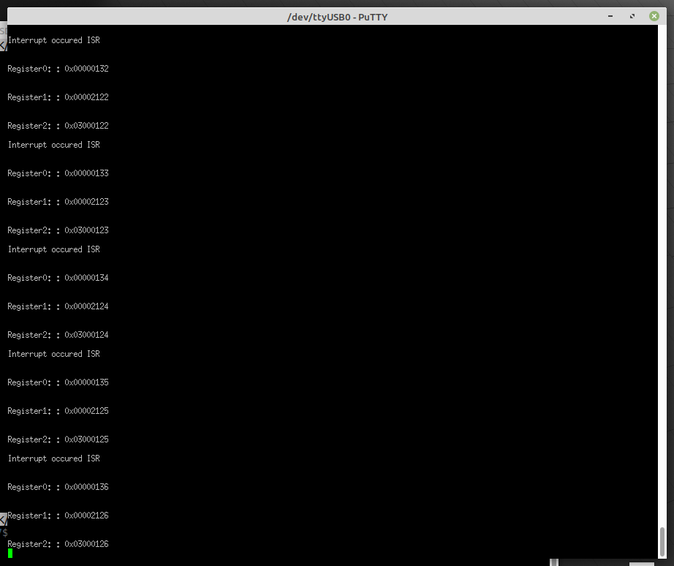

## TPM module with "Low Pin Count Protocol" build on SoC
### Introduction
The main goal of this document is showing the current state of development of TPM 
module with "LPC Protocol" based on SoC (System on Chip), and also documenting
work carried out so far.
## Motivation for doing this project
We still see the necessity of making TPM module with the "Low Pin Count" protocol.
There are still many computers on the market (especially servers) that have 
motherboards supporting LPC protocol. We considered possible hardware platforms 
in the past in this document[Target TPM hardware interfaces](https://lpntpm.lpnplant.io/hardware_interfaces/#low-pin-count-interface)
Outside of fast `SPI Bus` and even `I2C` protocol it is relatively easy to 
implement on MCU hardware just "LPC protocol" makes it difficult to implement on 
MCU.
## Previous attempt to implement the LPC protocol on the MCU
We attempted to implement "LPC protocol" (LPC Peripheral) on MCU, but 
this attempt hasn't been successfully completed. "ESP32-WROOM32" board has been 
chosen as the hardware platform. This hardware was Dual-Core Tensilica LX6 with
240 MHz clock and 512 KB SRAM, which is quite a powerful MCU. Here is a picture 
of test circuit:


We started our test with a very simple application in "Arduino IDE" for switching
the output GPIO pin using an interrupt assigned to another GPIO (Input) pin. For this 
input pin, there was a 33 Mhz clock signal attached. In the interrupt routine, the state 
of the output GPIO pin had been negated. Here is screen-shot from logic analyzer 
software:

The signal in channel 0 is a 33 Mhz clock, and the signal in channel 2 is an output GPIO
pin. The maximum frequency of switching GPIO pins we could reach on this hardware
was close to 380 Khz. The main reason for such bad results had been big latency 
in interrupts handling. We also considered some versions of STM32 family MCUs, 
but resulting from the documentation that it is not possible to get much better results
than this of "ESP32" hardware.

We concluded that the best way of implementing "LPC protocol" would
be the use of a programmable device like an FPGA or CPDL. But we also need a CPU for 
implementation of TPM module logic and a quite much amount of RAM. So the need of
using together MCU and FPGA ICs in one project causes a large size of PCB for TPM 
module. Fortunately, last years appeared ICs called SoC (System on Chip) which
combine these two MCU and FPGA in one chip.
## Hardware platform for this project
The most serious issue in our previous attempts to implement the TPM module was 
the lack of enough SRAM memory amount available for MCU, so one of the basic 
requirements for a new hardware platform is the big amount of SRAM memory. The 
second assumption for new hardware is the existence of programmable logic (FPGA)
and a fast bus connecting FPGA and MCU. The third assumption is efficient MCU with
needed peripherals. The last requirement is the possibility of using open-source
software for the development applications for this hardware.

Our choice of new hardware platform for this project is 
"QuickLogic EOS™ S3 MCU + eFPGA SoCs". It combines ARM Cortex-M4 MCU with 512 KB 
of SRAM (max. clock frequency is 80 Mhz) and FPGA.FPGA and MCU are connected by 
a fast "Wishbone Bus" and can handle interrupts from FPGA to MCU. The MCU has many
peripherals like "SPI controllers", "I2C controllers", UARTs, Timers, Watchdog timers.

`Quicklogic EOS S3 MCU + eFPGA SoC` had been chosen for the hardware part of this 
project because it fulfills all requirements related to the amount of RAM and 
overall performance. Here is the link to the description of this SoC

[Quicklogic EOS S3 SoC](https://www.mouser.pl/new/quicklogic/quicklogic-eos-s3-mcu-efpga-socs/)

We carried out all development on an open-hardware board called `Sparkfun QuickLogic
Thing Plus - EOS S3`. This board is based on Quicklogic `EOS S3` SoC - here is
the link to this product:
[Sparkfun QuickLogic Thing Plus - EOS S3](https://www.sparkfun.com/products/17273)

Here is hardware manual from Quicklogic company:

[QuickLogic EOS S3 Ultra Low Power multicore MCU datasheet](https://cdn.sparkfun.com/assets/7/a/c/c/e/QL-EOS-S3-Ultra-Low-Power-multicore-MCU-Datasheet-v3_3d.pdf)

And here is "Hookup Guide" for "Sparkfun QuickLogic Thing Plus - EOS S3" board:

[QuickLogic Thing Plus (EOS S3) Hookup Guide](https://learn.sparkfun.com/tutorials/quicklogic-thing-plus-eos-s3-hookup-guide#hardware-overview)

Below is picture of circuit used for development of this project:


It consist of such parts:

- "Sparkfun QuickLogic Thing Plus - EOS S3" board
- breadboard
- power adapter
- J-Link JTAG programmer/debugger
- USB 2 UART converter

Note that we used for programming and debugging "SEGGER J-Link" JTAG debugger,
but one can use instead of it different JTAG debugger (or simple board based on 
FTDI IC (FT232Rl)) and "OpenOCD" software for this purpose.
### Software needed for development of this project
All development - both FPGA Verilog RTL part and ARM Cortex-M4 MCU development
had been carried out using "Qiucklogic QORC SDK". "QORC SDK" consist of the 
following parts:

- Symbiflow package for making FPGA synthessis (Yosys) and "place and route" tool
  for implementation and generating bitstream for FPGA
- GCC-cross compiler for ARM Cortex
- FreeRTOS
- Zephyr-RTOS

"QORC SDK" is in all its parts open-source.

Here is link to "QORC-SDK" Github repository:["QORC-SDK Github repository"](https://github.com/QuickLogic-Corp/qorc-sdk)
and here is link to "Quicklogic Corporation" github repositories:["Quicklogic Corporation" Github repositories"](https://github.com/QuickLogic-Corp) 

`QORC SDK"` is only one software tool needed for the development of all parts of 
the application for SoC "EOS S3". However, there is also very useful software for making 
Verilog RTL code simulation. We used for simulating this project open-source 
Verilog simulator called "Icarus Verilog". We also used an open-source viewer for 
.vcd files called "GTKWave".

Here is link to "Icarus Verilog":
["Icarus Verilog simulator"](http://iverilog.icarus.com/)
, and here is link to "GTKWave" application:
["GTKWave" application](http://gtkwave.sourceforge.net/)

### Project Github repositories
Github repository with source code (Verilog RTL code) of `LPC peripheral` and all  
files needed to perform simulation are located at this URL:
[TPM LPC protocol implementation](https://github.com/lpn-plant/lpntpm-lpc-verilog)

There are several files in this repository:

-  lpc_periph.v     (this is Verilog `LPC Peripheral` implementation)
-  lpc_host.v       (this is Verilog `LPC Host` implementation)
-  lpc_defines.v    (this is auxiliary file with constans used in implementation)
-  lpc_periph_tb.v    (this is test-bench for `LPC Peripheral` implementation)
- 
In second Github repository at address: 
[`EOS S3` SoC applications](https://github.com/lpn-plant/lpntpm-eos-s3-examples)
are placed applications (FPGA and ARM Cortex-M4 MCU) for Quicklogic SoC `EOS S3`.

At this URL: [`EOS S3` test applications](https://github.com/lpn-plant/lpntpm-eos-s3-examples/tree/master/SOC_EOS_S3_Application_Test_comunication) is located application for SOC 
"EOS S3" (Quicklogic) testing internal communication between FPGA and MCU parts 
using in this purpose "Wishbone Bus" and interrupts.

And finally at this URL: [`EOS S3 application with embedded LPC Peripheral](https://github.com/lpn-plant/lpntpm-eos-s3-examples/tree/master/SOC_EOS_S3_Application_Test_comunication)
is located application for SOC "EOS S3" (Quicklogic) with embedded "LPC Protocol 
Peripheral" (implemented in FPGA part). Application is reading I/O LPC cycles 
(using I/O ports from FPGA sockets) and displaying these cycles data (LPC Address,
LPC Data, and cycle type) by UART in SOC MCU part.
### Verilog (FPGA based) implementation of "Low Pin Count" (LPC) protocol
Because in TPM part of a project we only need to handle the I/O or TPM cycle of LPC protocol we develop a minimalistic implementation of "LPC Peripheral". Before 
writing RTL code in Verilog we study several open-source implementations of LPC protocol.

The basic reference for implementing LPC protocol was Intel company "Intel Low Pin
Count(LPC) interface Specification" document:["Intel Low Pin Count(LPC) interface Specification"](https://www.intel.com/content/dam/www/program/design/us/en/documents/low-pin-count-interface-specification.pdf)

These three Verilog RTL modules had been implemented

+ LPC Peripheral (Slave) which is in final step embedded in SoC TPM application
+ LPC Host which is used in test-bench for LPC Peripheral
+ LPC Peripheral test-bench (LPC Host is also used in test-bench for sending data by LPC protocol to LPC Peripheral)

This implemeentation of "LPC Peripheral" can handle such types of LPC cycles:

+ I/O LPC cycles (1 byte)
+ TPM LPC cycles (1 byte)

Other cycles of LPC protocol (for example Memory, Firmware, DMA) are not supported
by this implementation.

The Verilog "LPC Peripheral" source is located at this path  in repository:
["LPC Peripheral Verilog source"](https://github.com/lpn-plant/lpntpm-lpc-verilog)

This implementation is based on a simple FSM (Finite state machine) handling individual
phases of the LPC protocol cycle. There is also code for handling I/O ports and internal
signals states for every phase of the LPC cycle
##### Here is table with all I/O ports of "LPC Peripheral" module
| Direction | Type | Bus    | Port name       |
|-----------|------|--------|-----------------|
|   input   | wire |        |     clk_i       |
|   input   | wire |        |   nrst_i        |
|   input   | wire |        |   lframe_i      |
|   inout   | wire | [ 3:0] |    lad_bus      |
|   input   | wire |        |    addr_hit_i   |
|   output  |  reg | [ 4:0] | current_state_o |
|   input   | wire | [ 7:0] |      din_i      |
|   output  |  reg | [ 7:0] |  lpc_data_in_o  |
|   output  | wire | [ 3:0] |  lpc_data_out_o |
|   output  | wire | [15:0] |    lpc_addr_o   |
|   output  | wire |        |     lpc_en_o    |
|   output  | wire |        |   io_rden_sm_o  |
|   output  | wire |        |   io_wren_sm_o  |
|   output  |  reg | [31:0] |      TDATA      |
|   output  |  reg |        |      READY      | 

##### And here is table with I/O ports descriptions of "LPC Peripheral" module

| Port Name          |   Direction    | Description                                                                      |
|--------------------|:--------------:|----------------------------------------------------------------------------------|
| LPC Interface                                                                                                          |
| clk_i              |      Input     | LPC clock (33,3 MHz) from LPC Host                                               |
| nrst_i             |      Input     | Active-low reset signal                                                          |
| lframe_i           |      Input     | Active-low frame signal                                                          |
| lad_bus            | Bi-directional | Multiplexed Command, Address and Data Bus                                        |
| Back-end Interface                                                                                                     |
| addr_hit_i         |      Input     |                                                                                  |
| current_state_o    |     Output     | Current peripheral state  (FSM)                                                  |
| din_i              |      Input     | Data sent when host requests a read                                              |
| lpc_data_in_o      |     Output     | Data received by peripheral for writing                                          |
| lpc_data_out_o     |     Output     | Data sent to host when a read is requested                                       |
| lpc_addr_o         |     Output     | 16-bit LPC Peripheral Address                                                    |
| lpc_en_o           |     Output     | Active-high status signal indicating the peripheral is ready for next operation. |
| io_rden_sm_o       |     Output     | Active-high read status                                                          |
| io_wren_sm_o       |     Output     | Active-high write status                                                         |
| TDATA              |     Output     | 32-bit register with LPC cycle: Address, Data(8-bit) and type of opertion        |
| READY              |     Output     | Active-high status signal indicating that new cycle data is on TDATA             |

As one can see in I/O ports of "LPC Peripheral" module there are four common 
signals of LPC protocol (LPC Host is connected to Peperipheral by these lines). 
These signals are:

+ clk_i
+ nrst_i
+ lframe_i
+ lad_bus  (this 4-bit bi-directional multiplexed bus)

Other signals are used for control the module and displaying information.

In this path in github repository is located Verilog file `lpc_periph_tb.v` with 
test-bench for performing simulation of `LPC Peripheral` module: [LPC Peripheral Verilog test-bench](https://github.com/lpn-plant/lpntpm-lpc-verilog/blob/main/lpc_periph_tb.v)

In `lpc_periph_tb.v` file (from line 76) is fragment of code setting the name of .vcd
dump file with waveforms :
```verilog
initial
begin
 	// Initialize
     $dumpfile("lpc_periph_tb.vcd");
     $dumpvars(0,lpc_periph_tb);

```
In line (121) there is for loop generating 128 I/O cycles (alternately write and read):
```verilog
for (i = 0; i <= 128; i = i + 1) begin 
        // Perform write
        #40  LFRAME_in  = 0;
        IO_Read_Flag   = 0;
. . .
```
The test-bench file also uses implementation of module `lpc_host` and 
instantiation of modules `lpc_host` and `lpc_periph`. All of them are needed for 
simulating the "LPC Peripheral" module. The accomplishment of simulation
before tests on hardware (FPGA board) is very important and we carried out this 
process in great detail. Manual hot to simulate "LPC Peripheral"
module is placed on this README file in the Github repository:[LPC Peripheral Verilog simulation](https://github.com/lpn-plant/lpntpm-lpc-verilog)

##### Few details of "LPC Peripheral" module implementation
1. In line 42 of `lpc_periph.v` source is declared port:
```verilog
inout  wire [ 3:0] lad_bus
```
This is a bi-directional (and tri-state) 4-bit bus. This bus is multiplexed and in 
different time slots during handling of the LPC cycle this bus shows up various 
data (for. example: 4-bit parts of LPC Address, LPC Data, etc.).
  
In source file `lpc_defines.v` are definitions of FSM states constans:
```verilog
//---- FSM states definitions --------------------------
   `define LPC_START       4'b0000
   `define LPC_STOP        4'b1111
   `define LPC_FW_READ     4'b1101
   `define LPC_FW_WRITE    4'b1110
. . .
```
In lines from 133 to 203 of `lpc_periph.v` there is implementation of main FSM
(Finite State Machine) supporting transitions between different phases of LPC
protocol cycles:
```verilog
always @(*) begin
        if (nrst_i == 1'b0) fsm_next_state <= `LPC_ST_IDLE;
        if (lframe_i == 1'b0) fsm_next_state <= `LPC_ST_IDLE;
        case(current_state_o)
            `LPC_ST_IDLE:
             begin
                 if (nrst_i == 1'b0) fsm_next_state <= `LPC_ST_IDLE;
                 else if ((lframe_i == 1'b0) && (lad_bus == 4'h0)) fsm_next_state <= `LPC_ST_START;
             end
             `LPC_ST_START:
              begin
. . .
```
In lines from 99 to 111 of `lpc_periph.v` there is always block in which is determined
when new cycle was started and when LPC cycle data are ready these data are packed and 
copied to 32-bit TDATA bus:
```verilog
if (wasLpc_enHigh) begin
                cycle_cnt = cycle_cnt + 1;
                if ((cycle_cnt > 1) && (cycle_cnt < 3)) begin
                    dinAbuf[31:28] <= 4'b0000;
                    dinAbuf[27:12] <= lpc_addr_o_reg;
                    dinAbuf[11:4] <= lpc_data_in_o;
                    dinAbuf[3:2] <= 2'b00;
                    dinAbuf[1:0] <= cycle_type;
                    if (dinAbuf==memoryLPC[0]) newValuedata = 1'b0;
                    else newValuedata = 1'b1;
                    TDATA <= dinAbuf;
                    memoryLPC[0] <= dinAbuf;
                end
```
As one can see bits from [31:28] are filled with four zeros. On bits [27:12] there 
is placed 16-bits LPC Address. On bits [11:4] is located 8-bit LPC Data. And finally
on bits [3:0] is stored cycle type: 1 is written cycle and 0 is read cycle.
In this last always block is also worked out READY signal. When READY is High (1'b1)
it means that there is new cycle data on TDATA bus. In target application for SoC
"EOS S3" (FPGA+MCU) LPC cycle data from TDATA bus are sent by internal "Wishbone Bus"
to MCU ARM Cortex=M4 when this data is displayed on MCU UART.
##### Results of "LPC Peripheral" module simulation

Let first look at basic LPC protocol signals:
+ LCLK_in is LPC clock 33,3 Mhz
+ LRESET_in is LPC reset
+ LFRAME_in - Low state marks new LPC cycle
+ IO_Read_StatusO - High state marks read cycle
+ IO_Write_Status) - high state marks write cycle
+ Host_Ready - tells that Host is ready to handle next cycle
+ peri_en - tells that LPC Peripheral is ready for next cycle

And now what is very important:
+ current_host_state[4:0] - this is 4-bit value of current host FSM state
+ current_peri_state[4:0] - this is 4-bit value of current peripheral FSM state

One can see that states on LPC peripheral mimics states from LPC Host and sequences
of states for I/O read cycle and I/O write cycle are in accordance with states
described in Intel reference document describing "Low Pin Count Protocol".
Conclusion: the basic LPC Protocol signals are correct in presented simulation.



On second screen from "GTKWave" the time scale is liitle differnt from previous
screen. Important are signals:
+ Host_Address_in[15:0] - this is LPC address on LPC Host
+ Host_Write_in[7:0] - this is 8-bit LPC data on LPC Host

One can see that these address and data with some delay apperas on LPC Peripheral
signals:
+ Peri_Address_out[15:0] - received from Host LPC address
+ Peri_Write_out[7:0] - received from Host LPC cycle data

And finally one can see that LPC Address and LPC Data appear with some delay on 
TDATABou[31:0] - on this 32-bit bus are written LPC Address and LPC Data as has
been described above. READYNET signal indicates that there is new data on TDATA
bus. These two last signals (TDATA and READY) are used for sending LPC cycle data
from FPGA to the MCU part of the SoC application.
Summing up: after watching the simulation of "LPC Peripheral" we have solid foundation
to say that the tested circuit is working correctly.

### "EOS S3" SoC application for testing connection between FPGA and MCU by internal "Wishbone Bus" (and using interrupts)
Quicklogic SoC "EOS S3" is rather complex circuit what you can see studying it's
technical manual at this URL:[EOS S3 Technical Reference Manual](https://cdn.sparkfun.com/assets/f/2/a/c/5/QL-S3-Technical-Reference-Manual-revisionv1.1a.pdf)

After reading this documentation we were missing a few important details that needed to 
implement SoC application which from FPGA part send data to ARM MCU program using
internal "Wishbone Bus" to "AHB Bus" bridge and can set interrupt in FPGA part.
Frankly speaking, we needed bi-directional communication between FPGA and MCU in SoC.
It wasn't clear how to generate all needed clocks, reset signals, set up interrupts
in the FPGA part, and how to declare signals controlling the behavior of the internal "Wishbone Bus".

Happily for us one of employee of "Quicklogic Corporation" post in his Github
repository very valuable examples of application for "EOS S3" SoC. Here is this
repository: ["EOS S3 SoC QORC-SDK example applications"](https://github.com/coolbreeze413/qorc-onion-apps)
One of these examples located at this link: [EOS S3 SoC QORC-SDK example application](https://github.com/coolbreeze413/qorc-onion-apps/tree/master/qorc_fpga_compositeGPBTctrl) has been using such comunication between FPGA and MCU
parts of SoC. Basing on this example we wrote simpler application using comunication
between FPGA and MCU using "Wishbone Bus" and interrupts from FPGA to MCU. Here 
is link  to this test application: [EOS S3 SoC QORC-SDK example application](https://github.com/lpn-plant/lpntpm-eos-s3-examples/tree/master/SOC_EOS_S3_Application_Test_comunication)
 
In top module of FPGA part of this application in file "AL4S3B_FPGA_Top.v" - see
link: ["EOS S3 SoC QORC-SDK example top module"](https://github.com/lpn-plant/lpntpm-eos-s3-examples/blob/master/SOC_EOS_S3_Application_Test_comunication/fpga/rtl/AL4S3B_FPGA_Top.v)

One can see that top module:
```verilog
module AL4S3B_FPGA_Top (
    
    // io_pad(s) from constraint file
    io_pad
);
```
hasn't declared clock and asynchronous reset. We found that needed clocks and other
signals (for example resets, Wishbone bus signals, etc.) are injected into the top module
by use of the "cell_macro" primitive. "cell_macro" is part of SoC hardware (Similiar 
to IP core). It gave us the explanation of things that weren't clear before studying
this example application. Here is the "cell_macro" used for generating clocks and other 
important signals for SoC:
```verilog
// Verilog model of QLAL4S3B
qlal4s3b_cell_macro 
    u_qlal4s3b_cell_macro 
    (
        // AHB-To-FPGA Bridge
        .WBs_ADR                   ( WBs_ADR                        ), // output [16:0] | Address Bus                   to   FPGA
        .WBs_CYC                   ( WBs_CYC                        ), // output        | Cycle Chip Select             to   FPGA
        .WBs_BYTE_STB              ( WBs_BYTE_STB                   ), // output  [3:0] | Byte Select                   to   FPGA
        .WBs_WE                    ( WBs_WE                         ), // output        | Write Enable                  to   FPGA
        .WBs_RD                    ( WBs_RD                         ), // output        | Read  Enable                  to   FPGA
        .WBs_STB                   ( WBs_STB                        ), // output        | Strobe Signal                 to   FPGA
        .WBs_WR_DAT                ( WBs_WR_DAT                     ), // output [31:0] | Write Data Bus                to   FPGA
        .WB_CLK                    ( WB_CLK                         ), // input         | FPGA Clock                    from FPGA
        .WB_RST                    ( WB_RST                         ), // output        | FPGA Reset                    to   FPGA
        .WBs_RD_DAT                ( WBs_RD_DAT                     ), // input  [31:0] | Read Data Bus                 from FPGA
        .WBs_ACK                   ( WBs_ACK                        ), // input         | Transfer Cycle Acknowledge    from FPGA

        // SDMA Signals
        .SDMA_Req                  ( {3'b000, 1'b0}                 ), // input   [3:0]
        .SDMA_Sreq                 ( 4'b0000                        ), // input   [3:0]
        .SDMA_Done                 (                                ), // output  [3:0]
        .SDMA_Active               (                                ), // output  [3:0]

        // FB Interrupts
        .FB_msg_out                ( {1'b0, 1'b0, 1'b0, FPGA_INTR[0]}), // input   [3:0]
        .FB_Int_Clr                ( 8'h0                           ), // input   [7:0]
        .FB_Start                  (                                ), // output
        .FB_Busy                   ( 1'b0                           ), // input

        // FB Clocks
        .Sys_Clk0                  ( Sys_Clk0                       ), // output
        .Sys_Clk0_Rst              ( Sys_Clk0_Rst                   ), // output
        .Sys_Clk1                  ( Sys_Clk1                       ), // output
        .Sys_Clk1_Rst              ( Sys_Clk1_Rst                   ), // output

        // Packet FIFO
        .Sys_PKfb_Clk              (  1'b0                          ), // input
        .Sys_PKfb_Rst              (                                ), // output
        .FB_PKfbData               ( 32'h0                          ), // input  [31:0]
        .FB_PKfbPush               (  4'h0                          ), // input   [3:0]
        .FB_PKfbSOF                (  1'b0                          ), // input
        .FB_PKfbEOF                (  1'b0                          ), // input
        .FB_PKfbOverflow           (                                ), // output

        // Sensor Interface
        .Sensor_Int                (                                ), // output  [7:0]
        .TimeStamp                 (                                ), // output [23:0]

        // SPI Master APB Bus
        .Sys_Pclk                  (                                ), // output
        .Sys_Pclk_Rst              (                                ), // output      <-- Fixed to add "_Rst"
        .Sys_PSel                  (  1'b0                          ), // input
        .SPIm_Paddr                ( 16'h0                          ), // input  [15:0]
        .SPIm_PEnable              (  1'b0                          ), // input
        .SPIm_PWrite               (  1'b0                          ), // input
        .SPIm_PWdata               ( 32'h0                          ), // input  [31:0]
        .SPIm_Prdata               (                                ), // output [31:0]
        .SPIm_PReady               (                                ), // output
        .SPIm_PSlvErr              (                                ), // output

        // Misc
        .Device_ID                 ( Device_ID                      ), // input  [15:0]

        // FBIO Signals
        .FBIO_In                   (                                ), // output [13:0] <-- Do Not make any connections; Use Constraint manager in SpDE to sFBIO
        .FBIO_In_En                (                                ), // input  [13:0] <-- Do Not make any connections; Use Constraint manager in SpDE to sFBIO
        .FBIO_Out                  (                                ), // input  [13:0] <-- Do Not make any connections; Use Constraint manager in SpDE to sFBIO
        .FBIO_Out_En               (                                ), // input  [13:0] <-- Do Not make any connections; Use Constraint manager in SpDE to sFBIO

        // ???
        .SFBIO                     (                                ), // inout  [13:0]
        .Device_ID_6S              ( 1'b0                           ), // input
        .Device_ID_4S              ( 1'b0                           ), // input
        .SPIm_PWdata_26S           ( 1'b0                           ), // input
        .SPIm_PWdata_24S           ( 1'b0                           ), // input
        .SPIm_PWdata_14S           ( 1'b0                           ), // input
        .SPIm_PWdata_11S           ( 1'b0                           ), // input
        .SPIm_PWdata_0S            ( 1'b0                           ), // input
        .SPIm_Paddr_8S             ( 1'b0                           ), // input
        .SPIm_Paddr_6S             ( 1'b0                           ), // input
        .FB_PKfbPush_1S            ( 1'b0                           ), // input
        .FB_PKfbData_31S           ( 1'b0                           ), // input
        .FB_PKfbData_21S           ( 1'b0                           ), // input
        .FB_PKfbData_19S           ( 1'b0                           ), // input
        .FB_PKfbData_9S            ( 1'b0                           ), // input
        .FB_PKfbData_6S            ( 1'b0                           ), // input
        .Sys_PKfb_ClkS             ( 1'b0                           ), // input
        .FB_BusyS                  ( 1'b0                           ), // input
        .WB_CLKS                   ( 1'b0                           )  // input

    );
```
As one can see there is much more than only clocks. There is one big disadvantage
related to using the "cell_macro" construct. This "cell macro" is just a "black box"
and we haven't any model of how it works. This fact makes it an impossible simulation of 
FPGA is part of the application for SoC "EOS S3", so we can't determine this way if 
an application is working properly.
We just check if communication between FPGA and ARM Cortex-M4 MCU using "Wishbone Bus"
to "AHB" bridge and interrupts using hardware.

In Verilog source file "AL4S3B_FPGA_ONION_LPCCTRL.v" - see link:
[EOS S3 SoC application module](https://github.com/lpn-plant/lpntpm-eos-s3-examples/blob/master/SOC_EOS_S3_Application_Test_comunication/fpga/rtl/AL4S3B_FPGA_ONION_LPCCTRL.v)
we declared three 32-bit registers:
```verilog
reg     [31:0]  BREATHE_0_CONFIG   = 32'h00000010;         
reg     [31:0]  BREATHE_1_CONFIG   = 32'h00002000;
reg     [31:0]  BREATHE_2_CONFIG   = 32'h03000000;     
```
Then in always block:
```verilog
     //-----------------------------------------------
       cnt3 = cnt3 + 1;
       if ((cnt3 >= 1024000) && (cnt3 < 1024900))
       begin //period 1.25s
	     if (cnt3==1024000)
	     begin 	 
    	   BREATHE_0_CONFIG = BREATHE_0_CONFIG + 1;
    	   BREATHE_1_CONFIG = BREATHE_1_CONFIG + 1;
    	   BREATHE_2_CONFIG = BREATHE_2_CONFIG + 1;
    	 end  
    	 TIMER_o = 4'b1111;  //activate interrupt for MCU part
       end
       else if (cnt3 >= 1024900)
       begin
	      cnt3 = 20'h00000;
	      TIMER_o = 4'b0000;  //deactivate interrupt for MCU part	   
       end
    end  
```
we periodically increment these register and set TIMER_o = 4'b1111; signal which
is interrupt vector passed to MCU. When MCU get this inttrupt it programatically
reads these registers by internal "Wishbone Bus" 2 "AHB" bridge. After short time
the interrupt in FPGA is deactivated: TIMER_o = 4'b0000;

In MCU program in running RTOS task is handler for message generated in interrupt
ISR routin. In task code we have such fragment:
```c
      case TIMERCTRL0_ISR:
                    dbg_str("\nInterrupt occured ISR\n");

					uint32_t register0 = hal_fpga_onion_breath_getval_reg (22);
					dbg_str("\n\n");
					dbg_str_hex32("Register0: ", register0);

					uint32_t register1 = hal_fpga_onion_breath_getval_reg (21);

					dbg_str("\n\n");
					dbg_str_hex32("Register1: ", register1);

					uint32_t register2 = hal_fpga_onion_breath_getval_reg (18);

					dbg_str("\n\n");
					dbg_str_hex32("Register2: ", register2);

                    break;
```
In this code when message is detected, the values of these three registers are read 
from FPGA and display by MCU UART.
Short manual how to build this test application is on it's github page:
[EOS S3 SoC test application](https://github.com/lpn-plant/lpntpm-eos-s3-examples/tree/master/SOC_EOS_S3_Application_Test_comunication)
The assumption to this manual is that "QORC-SDK" is properly installed. Here is
quick manual how to install "QORC-SDK" and perform basic tasks:
[QORC-SDK quick guide](https://qorc-sdk.readthedocs.io/en/latest/qorc-setup/quickstart.html#bootloader-update)

After test application is built and loaded to hardware we can see on UART window
changing values (incremented by one in cycle) of three test register get from F
PGA - see screen:



### "EOS S3" SoC application with embedded "LPC Peripheral"
In the final step of this part of the development, we embeded developed in an earlier step
Verilog implementation of "LPC Peripheral" into SoC "EOS S3" application. As was
mentioned we cannot simulate the FPGA part of the SoC application because of the use of 
"black-box" "cell_macro" construction. This SoC application with embedded 
"LPC Peripheral" is located in this path in the project repository:
[SoC EOS S3 application with embedded LPC Peripheral](https://github.com/lpn-plant/lpntpm-eos-s3-examples/tree/master/SOC_EOS_S3_Application_With_LPC_peripheral)
On this WWW page is also located short manual how to build application.
##### Short description of "EOS S3" SoC application with embedded Verilog "LPC Peripheral" implementation
What was changed in FPGA part of application:
1. In top module "AL4S3B_FPGA_Top" were additional ports of LPC protocol added:
```verilog
module AL4S3B_FPGA_Top (
    // LPC Slave Interface
	lpc_lclk_top         , // LPC clock 33 Mhz     (external from LPC Host)
	lpc_lreset_n_top     , // Reset - Active Low   (external from LPC Host)
	lpc_lframe_n_top      , // Frame - Active Low   (external from LPC Host)
	lpc_lad_in_top       , // Bi-directional 4-bit LAD bus (tri-state) (external from LPC Host)
	
    // io_pad(s) from constraint file
    io_pad,
	
	//Wisbone bys clock 80 Mhz
	clk80Mhz
);
```
```verilog
// io_pad(s)
inout   wire    [15:0]   io_pad ; //Decreased from [31:0]

// LPC Slave Interface
input  wire        lpc_lclk_top         ; // LPC clock 33 Mhz
input  wire        lpc_lreset_n_top     ; // Reset - Active Low 
input  wire        lpc_lframe_n_top     ; // Frame - Active Low
inout  wire [ 3:0] lpc_lad_in_top       ; // Bi-directional 4-bit LAD bus (tri-state)

//Wisbone clock
 output wire clk80Mhz;               //Clock 80 Mhz
```
2. In module "AL4S3B_FPGA_IP" also ports of LPC protocol had been added:
```verilog
module AL4S3B_FPGA_IP ( 

    // CLOCK/RESET
    CLK_IP_i,
    RST_IP_i,

    // AHB-To_FPGA Bridge I/F
    WBs_ADR,
    WBs_CYC,
    WBs_BYTE_STB,
    WBs_WE,
    WBs_RD,
    WBs_STB,
    WBs_WR_DAT,
    WB_CLK,
    WB_RST,
    WBs_RD_DAT,
    WBs_ACK,

    // io_pad
    io_pad,

    // FPGA Interrupts
    FPGA_INTR,
	
	// LPC Slave Interface
	lpc_lclk,     // LPC clock 33 Mhz
	lpc_lreset_n, // Reset - Active Low 
	lpc_lframe_n, // LPC Frame - Active Low
    lpc_lad_in    // Bi-directional 4-bit LAD bus (tri-state)	
	
);
```
During instantation of "AL4S3B_FPGA_ONION_LPCCTRL" module in which is embbeded
"LPC Peripheral" - these ports also had been added:
```verilog
AL4S3B_FPGA_ONION_LPCCTRL
    u_AL4S3B_FPGA_ONION_LPCCTRL 
    (
        // AHB-To_FPGA Bridge I/F
        .WBs_ADR_i          ( WBs_ADR                           ),
        .WBs_CYC_i          ( WBs_CYC_ONION_LPCCTRL             ),
        .WBs_BYTE_STB_i     ( WBs_BYTE_STB                      ),
        .WBs_WE_i           ( WBs_WE                            ),
        .WBs_STB_i          ( WBs_STB                           ),
        .WBs_DAT_i          ( WBs_WR_DAT                        ),
        .WBs_CLK_i          ( WB_CLK                            ), //80 Mhz
        .WBs_RST_i          ( WB_RST                            ),
        .WBs_DAT_o          ( WBs_DAT_o_ONION_LPCCTRL           ),
        .WBs_ACK_o          ( WBs_ACK_ONION_LPCCTRL             ),

        //System clk
        .Sys_clk            ( CLK_IP_i                          ), //33 Mhz 
		
		//System reset
		.Sys_reset          ( RST_IP_i                          ),  

        // BREATHE signals
        .BREATHE_o          ( FPGA_IP_LPC_o[31:0]               ),

        // TIMER output interrupts
        .TIMER_o            ( FPGA_INTR                         ),
		
		// LPC Slave Interface
		.lpc_lclk           ( lpc_lclk                          ),   // LPC Frame input (active high)
		.lpc_lreset_n       ( lpc_lreset_n                      ),      // LPC AD Output Enable
		.lpc_lframe_n       ( lpc_lframe_n                      ),       // LPC AD Input Bus
		.lpc_lad_in         ( lpc_lad_in                        ),       // LPC AD Output Bus
    );
```
3. In module "AL4S3B_FPGA_ONION_LPCCTRL" I/O ports looks like:
```verilog
module AL4S3B_FPGA_ONION_LPCCTRL ( 
    
    // AHB-To_FPGA Bridge I/F
    WBs_ADR_i,
    WBs_CYC_i,
    WBs_BYTE_STB_i,
    WBs_WE_i,
    WBs_STB_i,
    WBs_DAT_i,
    WBs_CLK_i,  //80 MHz
    WBs_RST_i,
    WBs_DAT_o,
    WBs_ACK_o,

    // System clk 33 Mhz
    Sys_clk,
	
	//System reset
	Sys_reset,
            
    // BREATHE signals
    BREATHE_o,
      
    // TIMER signals
    TIMER_o,
	
	// LPC Slave Interface
	lpc_lclk,     // LPC clock 33 Mhz
	lpc_lreset_n, // Reset - Active Low 
	lpc_lframe_n, // LPC Frame - Active Low
	lpc_lad_in    // Bi-directional 4-bit LAD bus (tri-state)	
);
```
In lines from 289 there is instantation of developed earlier "LPC_Peri" module:
```verilog
//***************************
// LPC Peripheral instantiation
//***************************
lpc_periph lpc_periph_inst(
// LPC Interface
.clk_i(lpc_lclk),
.nrst_i(lpc_lreset_n),
.lframe_i(lpc_lframe_n),
.lad_bus(lpc_lad_in),
.addr_hit_i(i_addr_hit_sig),
.current_state_o(o_current_peri_state_sig),
.din_i(i_din_sig),
.lpc_data_in_o(o_lpc_data_in_sig),
.lpc_data_out_o(o_lpc_data_out_sig),
.lpc_addr_o(o_lpc_addr_sig),
.lpc_en_o(o_lpc_en_sig),
.io_wren_sm_o(o_io_wren_sm_sig),
.io_rden_sm_o(o_io_wren_sm_sig),
//----------------------------------
.TDATA(TDATA_sig),
.READY(READY_sig)
);  
```
Caution: currently in module "AL4S3B_FPGA_ONION_LPCCTRL" we have two clock domains:
+ one: with WBs_CLK_i - it is 80 Mhz internal SoC Wishbone Bus clock
+ second: lpc_lclk - it is external 33 Mhz LPC clock (from LPC Host)
Using many clock domains requires taking special steps in module implementation.
See this link: ["Understanding CDC issues in digital design"](https://www.icdesigntips.com/2020/12/understanding-cdc-issues-in-digital-ic.html)
From this reason in module code (lines from 214 to 230) is generated signal clock
enable for LPC clock (33MHz):
```verilog
/generating clock_33Mhz_enable signal
always @(posedge WBs_CLK_i)
begin
  //if (WBs_CLK_i)
  //begin
    if (counter == divisor)
    begin
	  counter <= 4'b0000;
      clock_33Mhz_enable <= 1'b1;
	end
	else
	begin
	  clock_33Mhz_enable <= 1'b0;
      counter <= counter + 1'b1;
	end
  //end
end
```
Here is always block for generating interrupt signal from FPGA 2 MCU(this interrupt 
cause that MCU reads register with LPC cycle data from FPGA):
```verilog
// Logic for determine cycle type and send cycle data
always @( posedge WBs_CLK_i)
begin
  if (clock_33Mhz_enable)
  begin
     if (READY_sig)
     begin
	   BREATHE_0_CONFIG_TMP = TDATA_sig; //all cycle data sent in one 32-bit register
	   TIMER_o = 4'b1111;  //activate interrupt for MCU part
	 end
	 else
	 begin
	   TIMER_o = 4'b0000;  //deactivate interrupt for MCU part		
	 end
  end
  else TIMER_o = 4'b0000;
end 
```
Then in C source file "mininimal_task.c" is code which handle interrupt from FPGA
and read register from FPGA and decode LPC Address, LPC Data, cycle type and prints
these data on MCU UART.
BTW: in source file: fpga/src/hal_fpga_onion_timerctrl.c is located code related
to interrupts handling.

As we mentioned earlier we weren't able to simulate this code, because of using
"cell_macro" construct.
### Further plans for development TPM module on Quicklogic "EOS S3" Soc
The current development of this project is starting point for development of full
"TPM" hardware module with LPC protocol support. 
###### In next steps we are going to:
1. Test working LPC protocol with "EOS S3" application on hardware: "Sparkfun 
QuickLogic Thing Plus - EOS S3" board. We implemented"LPC Host" Verilog module
which is needed for the test of "LPC Peripheral" on hardware. We are going to run 
"LPC Host" on second FPGA board connected by wires to "Quicklogic Thing Plus" board
and test correctness of operation of LPC peripheral. We also planning to write 
"Test Generator for LPC Host" as Verilog module - which will be able to generate 
test signals.
2. After determining that LPC cycles are properly detected and send to MCU in SoC
application, we are going to extend it to send back response by LPC protocol lines
in FPGA. We will define TPM registers in MCU and TPM cycles of LPC protocol should 
be able to write and read from these registers (FPGA + MCU) using LPC protocol.
3. Next step is to develop full TPM module based on reference Microsoft TPM module
sourcecode - see this repository: [Microsoft TPM module reference 2.0](https://github.com/lpn-plant/ms-tpm-20-ref)
3. The last step should be extending TPM module for more comunication protocols,
 for example fast "SPI Bus" and "LPC Protocol" 2 "SPI" bi-directional bridge.
