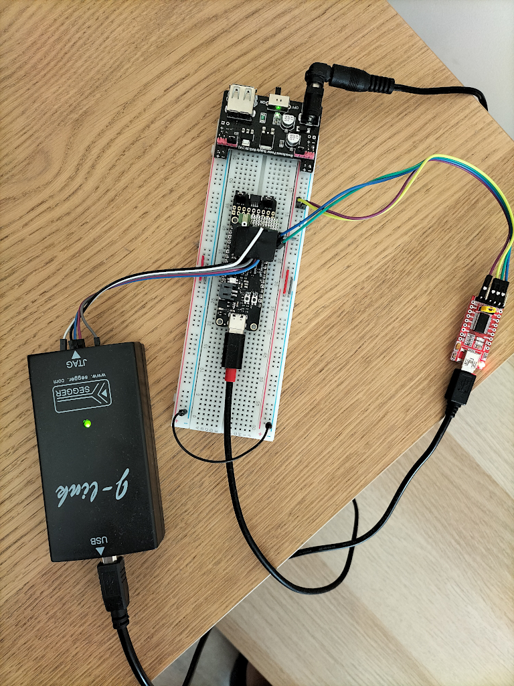

## Introduction

The main goal of this document is showing the current state of development of
the LPC driver for use in the lpnTPM project.

## Motivation

Even though the SPI interface for the TPM module is more and more popular, the
LPC (`Low Pin Count`) interface is still widely used as a way to connect TPM
module to the mainboard. We have considered possible hardware platforms in the
past in
[this document](hardware_interfaces.md#low-pin-count-interface).

While the SPI and I2C interfaces are available on each microcontroller out
there, the LPC hardware block is nearly not available on the generally-available
microcontrollers, which raises some challenge here.

## LPC implementation via GPIO

At first, we have attempted to implement the `LPC` interface on MCU via GPIO.
The `LPC` requires 33MHz clock, which might be challenging for a typical MCU.

Initially we have used `Nucleo L476` which is clocked ad 80MHz. We have decided
to use some other board for this test, instead. `ESP32-WROOM32` board has been
chosen as the hardware platform here. This hardware has dual-core Tensilica LX6
with 240 MHz clock and 512 KB SRAM, which is quite a powerful MCU. Here is a
picture of test circuit which was used during our experiments:


We have started our test with a very simple application in `Arduino IDE` for
switching the output GPIO pin using an interrupt assigned to another GPIO
(Input) pin. There was a 33 Mhz clock signal attached to this pin. In the
interrupt routine, the state of the output GPIO pin had been negated. Here
is screen-shot from logic analyzer software:


The signal in channel 0 is a 33 Mhz clock, and the signal in channel 2 is an
output GPIO pin. The maximum frequency of switching GPIO pins we could reach on
this hardware was close to 380 Khz. The main reason for such bad results has
been substancial latency in interrupts handling.

We have also considered some other versions  of STM32 family MCUs, but based on
the documentation, reaching the desieed frequency would be very challenging as
well.

## Shift towards FPGA

Given that we would not be able to switch the GPIO pins fast enough in reaction
to the 33MHz clock, we have concluded that the better way of implementing the
`LPC` driver could be the use of a programmable device like an FPGA or CPLD.

But we also need a CPU for implementation of the TPM module logic and
substantial amount of RAM. If we would use both MCU and FPGA on a single board,
it would cause a major increase in the board's size. Fortunately, in the
last years some SoCs (System on Chips) has appeared, which combine these two
(MCU and FPGA) into a single chip.

## Hardware selection

### Requirements

The most serious issues in our previous attempts to implement the TPM module was
[shortage of the SRAM memory](issues.md#memory-usage) in the selected MCU.
Based on that and our other previous attempts, we could outline the hardware
requirements for a new chip:

* sufficient (>256kB) amount of SRAM,
* existence of a programmable logic (FPGA), as well as a fast bus connecting
  FPGA and MCU,
* efficient MCU with desieed peripherals (such as SPI).

Another very important requirement (not strictly hardware-related) is the
possibility of using open-source software for the applications development for
this hardware.

### EOS S3 SoC

Our candidate for a new hardware platform for this project is
`QuickLogic EOS™ S3 MCU + eFPGA SoCs`. It combines ARM Cortex-M4 MCU with 512
KB of SRAM (max. clock frequency is 80 Mhz) and FPGA. FPGA and MCU are connected
by a fast `Wishbone Bus` and can handle interrupts from FPGA to MCU. The MCU
has many peripherals like `SPI`, `I2C`, `UARTs`, `Timers`, and so on.

`Quicklogic EOS S3 MCU + eFPGA SoC` had been chosen for the hardware part of
this project because it fulfills all requirements related to the amount of RAM
and overall performance. More description on this hardware can be found
[here](https://www.mouser.pl/new/quicklogic/quicklogic-eos-s3-mcu-efpga-socs/).

We carried out all development on an open-hardware board called
[Sparkfun QuickLogic Thing Plus - EOS S3](https://www.sparkfun.com/products/17273).
This board is based on Quicklogic `EOS S3` SoC.

Some more references on this SoC and board:

* [QuickLogic EOS S3 Ultra Low Power multicore MCU datasheet](https://cdn.sparkfun.com/assets/7/a/c/c/e/QL-EOS-S3-Ultra-Low-Power-multicore-MCU-Datasheet-v3_3d.pdf)
* [QuickLogic Thing Plus (EOS S3) Hookup Guide](https://learn.sparkfun.com/tutorials/quicklogic-thing-plus-eos-s3-hookup-guide#hardware-overview)

## Hardware setup

Below is picture of circuit used for development of this project:



It consist of the following parts:

* `Sparkfun QuickLogic Thing Plus - EOS S3` board
* breadboard
* power adapter
* J-Link JTAG programmer/debugger
* USB 2 UART converter

Note that in this photo we have used the `SEGGER J-Link` JTAG debugger for
programming and debugging, but one can use different JTAG debugger for this
purpose (such as the
[Olimex ARM-USB-OCD-H](https://www.olimex.com/Products/ARM/JTAG/ARM-USB-OCD-H/)
paired with [OpenOCD](https://openocd.org/).

## Software setup

All development - both FPGA Verilog RTL part and ARM Cortex-M4 MCU development
had been carried out using `Quicklogic QORC SDK`.
[QORC SDK](https://github.com/QuickLogic-Corp/qorc-sdk) consists of the
following parts:

* Symbiflow package for FPGA synthessis (Yosys) and `place and route` tool
  for implementation and generation of bitstream for FPGA
* GCC-cross compiler for ARM Cortex
* FreeRTOS
* Zephyr-RTOS

`QORC SDK` is fully open-source project.

Another useful tools used during development are:

* [Icarus Verilog simulator](http://iverilog.icarus.com/)
* [GTKWave ](http://gtkwave.sourceforge.net/)

These can be used to perform simulation of the implemented FPGA code.

## Software repositories

Github repository with source code (Verilog RTL code) of `LPC peripheral` and
all files needed to perform simulation are located
[in the lpntpm-lpc-verilog repository](https://github.com/lpn-plant/lpntpm-lpc-verilog).

There are several files in this repository:

*  `lpc_periph.v`- `LPC Peripheral` implementation in Verilog
*  `lpc_host.v` - `LPC Host` implementation in Verilog
*  `lpc_defines.v`- auxiliary file with definition of constants used in the
    implementation
*  `lpc_periph_tb.v` - test-bench for the `LPC Peripheral` implementation

Another source code repository is the
[lpntpm-eos-s3-examples](https://github.com/lpn-plant/lpntpm-eos-s3-examples).
It contains applications (FPGA and ARM Cortex-M4 MCU) for the `EOS S3` SoC.

Two applications are important here:
* [test communication application](https://github.com/lpn-plant/lpntpm-eos-s3-examples/tree/master/SOC_EOS_S3_Application_Test_comunication)
  - used for testing the internal communication between FPGA and MCU parts
    using the `Wishbone` bus and interrutps,
* [LPC test application](https://github.com/lpn-plant/lpntpm-eos-s3-examples/tree/master/SOC_EOS_S3_Application_With_LPC_peripheral)
  - used for testing the `LPC peripheral` embedded into the FPGA part,
  - application is reading LPC cycles, and displaying these cycles via UART in
    the MCU part.

## LPC driver implementation

Because in TPM part of a project we only need to handle the I/O or TPM cycles of
LPC protocol, we have develop a minimal implementation of the `LPC Peripheral`.
Before writing RTL code in Verilog, we have studied several open-source
implementations of LPC protocol, such as
[this one](https://opencores.org/projects/wb_lpc).

The main reference for implementation of the LPC driver was Intel company
[LPC interface Specification](https://www.intel.com/content/dam/www/program/design/us/en/documents/low-pin-count-interface-specification.pdf)
document.

The implementation so far can handle following types of LPC cycles:

* I/O LPC cycles (1 byte)
* TPM LPC cycles (1 byte)

Other cycles of LPC protocol (such as Memory, Firmware, DMA) are not supported.

This implementation is based on a simple FSM (Finite State Machine) handling
individual phases of the LPC protocol cycle. There is also code for handling
I/O ports and internal signals states for every phase of the LPC cycle.

### LPC Peripheral

#### I/O ports

Here is table with all I/O ports of the `LPC Peripheral` module:

| Direction | Type | Bus    | Port name       | Description                                                                      |
|-----------|------|--------|-----------------|----------------------------------------------------------------------------------|
|   input   | wire |        | clk_i           | LPC clock (33,3 MHz) from LPC Host                                               |
|   input   | wire |        | nrst_i          | Active-low reset signal                                                          |
|   input   | wire |        | lframe_i        | Active-low frame signal                                                          |
|   inout   | wire | [ 3:0] | lad_bus         | Multiplexed Command, Address and Data Bus                                        |
|   input   | wire |        | addr_hit_i      |                                                                                  |
|   output  |  reg | [ 4:0] | current_state_o |  Current peripheral state  (FSM)                                                 |
|   input   | wire | [ 7:0] | din_i           | Data sent when host requests a read                                              |
|   output  |  reg | [ 7:0] | lpc_data_in_o   | Data received by peripheral for writing                                          |
|   output  | wire | [ 3:0] | lpc_data_out_o  | Data sent to host when a read is requested                                       |
|   output  | wire | [15:0] | lpc_addr_o      | 16-bit LPC Peripheral Address                                                    |
|   output  | wire |        | lpc_en_o        |Active-high status signal indicating the peripheral is ready for next operation.  |
|   output  | wire |        | io_rden_sm_o    | Active-high read status                                                          |
|   output  | wire |        | io_wren_sm_o    | Active-high write status                                                         |
|   output  |  reg | [31:0] | TDATA           | 32-bit register with LPC cycle: Address, Data(8-bit) and type of opertion        |
|   output  |  reg |        | READY           |  Active-high status signal indicating that new cycle data is on TDATA            |

As one can see in I/O ports of the `LPC Peripheral` module, there are four
common signals of the `LPC` protocol (`LPC Host` is connected to `LPC Peripheral
by these lines). These signals are:

* clk_i
* nrst_i
* lframe_i
* lad_bus  (this 4-bit bi-directional multiplexed bus)

Other signals are used to control the module and display information, or for
internal purposes.

#### Details

1. In line 42 of `lpc_periph.v` source is declared port:

```verilog
inout  wire [ 3:0] lad_bus
```

This is a bi-directional (and tri-state) 4-bit bus. This bus is multiplexed and
in different time slots during handling of the LPC cycle this bus shows up
various data (for example: 4-bit parts of LPC Address, LPC Data, etc.).

In source file `lpc_defines.v` are definitions of FSM states constants:

```verilog
//---- FSM states definitions --------------------------
   `define LPC_START       4'b0000
   `define LPC_STOP        4'b1111
   `define LPC_FW_READ     4'b1101
   `define LPC_FW_WRITE    4'b1110
. . .
```

In lines from 133 to 203 of `lpc_periph.v` there is implementation of main FSM
(Finite State Machine) supporting transitions between different phases of LPC
protocol cycles:

```verilog
always @(*) begin
        if (nrst_i == 1'b0) fsm_next_state <= `LPC_ST_IDLE;
        if (lframe_i == 1'b0) fsm_next_state <= `LPC_ST_IDLE;
        case(current_state_o)
            `LPC_ST_IDLE:
             begin
                 if (nrst_i == 1'b0) fsm_next_state <= `LPC_ST_IDLE;
                 else if ((lframe_i == 1'b0) && (lad_bus == 4'h0)) fsm_next_state <= `LPC_ST_START;
             end
             `LPC_ST_START:
              begin
. . .
```

In lines from 99 to 111 of `lpc_periph.v` there is always block in which is
determined when new cycle was started and when LPC cycle data are ready these
data are packed and copied to 32-bit `TDATA` bus:

```verilog
if (wasLpc_enHigh) begin
                cycle_cnt = cycle_cnt + 1;
                if ((cycle_cnt > 1) && (cycle_cnt < 3)) begin
                    dinAbuf[31:28] <= 4'b0000;
                    dinAbuf[27:12] <= lpc_addr_o_reg;
                    dinAbuf[11:4] <= lpc_data_in_o;
                    dinAbuf[3:2] <= 2'b00;
                    dinAbuf[1:0] <= cycle_type;
                    if (dinAbuf==memoryLPC[0]) newValuedata = 1'b0;
                    else newValuedata = 1'b1;
                    TDATA <= dinAbuf;
                    memoryLPC[0] <= dinAbuf;
                end
```

The format of the data on the `TDATA` bus is as follows:

* bits `[31:28]` - filled with four zeros,
* bits `[27:12]` - placed 16-bits `LPC Address`,
* bits `[11:4]` - 8-bit `LPC Data`,
* bits `[3:0]` - cycle type (direction),
  - `1` for write,
  - `0` for read.

In this last `always` block is also worked out `READY` signal. When `READY` is
High `(1'b1)`, it means that there is new cycle data on `TDATA` bus. In target
application for the `EOS S3 SoC`, cycle data from `TDATA` bus are sent by
the internal `Wishbone` to the MCU when this data is displayed on `MCU UART`.

### Test bench

Test-bench for performing simulation of the `LPC Peripheral` module is
available in the:
[lpc_periph_tb.v file](https://github.com/lpn-plant/lpntpm-lpc-verilog/blob/main/lpc_periph_tb.v).

Following fragment dumps file with wave forms (`.vcd`):

```verilog
initial
begin
 	// Initialize
     $dumpfile("lpc_periph_tb.vcd");
     $dumpvars(0,lpc_periph_tb);
```

Following fragment is a main test routine - a `for loop`, generating 128 I/O
cycles (alternately write and read):

```verilog
for (i = 0; i <= 128; i = i + 1) begin
        // Perform write
        #40  LFRAME_in  = 0;
        IO_Read_Flag   = 0;
. . .
```

The accomplishment of simulation before tests on hardware (FPGA board) is very
important and we carried out this process in great detail. Manual on how to
simulate the `LPC Peripheral` module can be found in
[this README](https://github.com/lpn-plant/lpntpm-lpc-verilog).

#### Results analysis


Let's first look at basic LPC protocol signals:

* LCLK_in is LPC clock 33,3 Mhz
* LRESET_in is LPC reset
* LFRAME_in - Low state marks new LPC cycle
* IO_Read_StatusO - High state marks read cycle
* IO_Write_Status - high state marks write cycle
* Host_Ready - tells that Host is ready to handle next cycle
* peri_en - tells that LPC Peripheral is ready for next cycle

What is also very important:

* current_peri_state[4:0] - this is 4-bit value of current peripheral FSM state
* current_host_state[4:0] - this is 4-bit value of current host FSM state

One can see that states on the LPC peripheral mimics the states from LPC Host
and sequences of states for I/O read cycle and I/O write cycle are in accordance
with states described in the
[LPC interface specification](https://www.intel.com/content/dam/www/program/design/us/en/documents/low-pin-count-interface-specification.pdf)
Conclusion: the basic LPC Protocol signals are correct in presented
simulation.


On the second screen from `GTKWave` the time scale is a little different from
the previous screen. Important signals here are:

* Host_Address_in[15:0] - this is LPC address on LPC Host
* Host_Write_in[7:0] - this is 8-bit LPC data on LPC Host

One can see that these address and data with some delay appears on `LPC
Peripheral` signals:

* Peri_Address_out[15:0] - received from Host LPC address
* Peri_Write_out[7:0] - received from Host LPC cycle data

And finally, one can see that `LPC Address` and `LPC Data` appear with some
delay on `TDATABou[31:0]` - on this 32-bit bus are written `LPC Address` and
`LPC Data` as has been described above. `READYNET` signal indicates that there
is new data on `TDATA` bus. These two last signals (`TDATA` and `READY`) are
used for sending LPC cycle data from FPGA to the MCU part of the SoC
application.

Summing up: after watching the simulation of `LPC Peripheral` we have a solid
foundation to say that the tested circuit is working correctly.

## EOS S3 applications

### FPGA <--> MCU communication

The goal of this application if to test the communication between FPGA and MCU
by internal `Wishbone` (and using interrupts).

`Quicklogic EOS S3` is rather complex circuit what you can see studying
it's [Technical Reference Manual](https://cdn.sparkfun.com/assets/f/2/a/c/5/QL-S3-Technical-Reference-Manual-revisionv1.1a.pdf).

After reading this documentation we were missing a few important details that
were needed to implement SoC application which can send data from FPGA part to ARM
MCU program using internal bus. Frankly speaking, we needed bi-directional
communication between FPGA and MCU in SoC. It wasn't clear how to generate all
needed clocks, reset signals, set up interrupts in the FPGA part, and how to
declare signals controlling the behavior of the internal bus.

Happily for us, one of employee of `Quicklogic Corporation` posted
[in his Github repository](https://github.com/coolbreeze413/qorc-onion-apps)
very valuable examples of applications for the `EOS S3` SoC.

[One of these examples](https://github.com/coolbreeze413/qorc-onion-apps/tree/master/qorc_fpga_compositeGPBTctrl)
has been using such communication between FPGA and MCU parts of SoC. Based on
this, we wrote
[simpler application](https://github.com/lpn-plant/lpntpm-eos-s3-examples/tree/master/SOC_EOS_S3_Application_Test_comunication)
using comunication between FPGA and MCU using `Wishbone`, and interrupts from
FPGA to MCU.

In the
[AL4S3B_FPGA_Top.v](https://github.com/lpn-plant/lpntpm-eos-s3-examples/blob/master/SOC_EOS_S3_Application_Test_comunication/fpga/rtl/AL4S3B_FPGA_Top.v):
one can see that top module:

```verilog
module AL4S3B_FPGA_Top (

    // io_pad(s) from constraint file
    io_pad
);
```

hasn't declared clock and asynchronous reset. We found that needed clocks and
other signals (for example resets, Wishbone bus signals, etc.) are injected
into the top module by use of the `cell_macro` primitive. `cell_macro` is part
of SoC hardware (Similiar to IP core). It gave us the explanation of things
that weren't clear before studying this example application. Here is the
`cell_macro` used for generating clocks and other important signals for SoC:

```verilog
// Verilog model of QLAL4S3B
qlal4s3b_cell_macro
    u_qlal4s3b_cell_macro
    (
        // AHB-To-FPGA Bridge
        .WBs_ADR                   ( WBs_ADR                        ), // output [16:0] | Address Bus                   to   FPGA
        .WBs_CYC                   ( WBs_CYC                        ), // output        | Cycle Chip Select             to   FPGA
        .WBs_BYTE_STB              ( WBs_BYTE_STB                   ), // output  [3:0] | Byte Select                   to   FPGA
        .WBs_WE                    ( WBs_WE                         ), // output        | Write Enable                  to   FPGA
        .WBs_RD                    ( WBs_RD                         ), // output        | Read  Enable                  to   FPGA
        .WBs_STB                   ( WBs_STB                        ), // output        | Strobe Signal                 to   FPGA
        .WBs_WR_DAT                ( WBs_WR_DAT                     ), // output [31:0] | Write Data Bus                to   FPGA
        .WB_CLK                    ( WB_CLK                         ), // input         | FPGA Clock                    from FPGA
        .WB_RST                    ( WB_RST                         ), // output        | FPGA Reset                    to   FPGA
        .WBs_RD_DAT                ( WBs_RD_DAT                     ), // input  [31:0] | Read Data Bus                 from FPGA
        .WBs_ACK                   ( WBs_ACK                        ), // input         | Transfer Cycle Acknowledge    from FPGA

        // SDMA Signals
        .SDMA_Req                  ( {3'b000, 1'b0}                 ), // input   [3:0]
        .SDMA_Sreq                 ( 4'b0000                        ), // input   [3:0]
        .SDMA_Done                 (                                ), // output  [3:0]
        .SDMA_Active               (                                ), // output  [3:0]

        // FB Interrupts
        .FB_msg_out                ( {1'b0, 1'b0, 1'b0, FPGA_INTR[0]}), // input   [3:0]
        .FB_Int_Clr                ( 8'h0                           ), // input   [7:0]
        .FB_Start                  (                                ), // output
        .FB_Busy                   ( 1'b0                           ), // input

        // FB Clocks
        .Sys_Clk0                  ( Sys_Clk0                       ), // output
        .Sys_Clk0_Rst              ( Sys_Clk0_Rst                   ), // output
        .Sys_Clk1                  ( Sys_Clk1                       ), // output
        .Sys_Clk1_Rst              ( Sys_Clk1_Rst                   ), // output

        // Packet FIFO
        .Sys_PKfb_Clk              (  1'b0                          ), // input
        .Sys_PKfb_Rst              (                                ), // output
        .FB_PKfbData               ( 32'h0                          ), // input  [31:0]
        .FB_PKfbPush               (  4'h0                          ), // input   [3:0]
        .FB_PKfbSOF                (  1'b0                          ), // input
        .FB_PKfbEOF                (  1'b0                          ), // input
        .FB_PKfbOverflow           (                                ), // output

        // Sensor Interface
        .Sensor_Int                (                                ), // output  [7:0]
        .TimeStamp                 (                                ), // output [23:0]

        // SPI Master APB Bus
        .Sys_Pclk                  (                                ), // output
        .Sys_Pclk_Rst              (                                ), // output      <-- Fixed to add "_Rst"
        .Sys_PSel                  (  1'b0                          ), // input
        .SPIm_Paddr                ( 16'h0                          ), // input  [15:0]
        .SPIm_PEnable              (  1'b0                          ), // input
        .SPIm_PWrite               (  1'b0                          ), // input
        .SPIm_PWdata               ( 32'h0                          ), // input  [31:0]
        .SPIm_Prdata               (                                ), // output [31:0]
        .SPIm_PReady               (                                ), // output
        .SPIm_PSlvErr              (                                ), // output

        // Misc
        .Device_ID                 ( Device_ID                      ), // input  [15:0]

        // FBIO Signals
        .FBIO_In                   (                                ), // output [13:0] <-- Do Not make any connections; Use Constraint manager in SpDE to sFBIO
        .FBIO_In_En                (                                ), // input  [13:0] <-- Do Not make any connections; Use Constraint manager in SpDE to sFBIO
        .FBIO_Out                  (                                ), // input  [13:0] <-- Do Not make any connections; Use Constraint manager in SpDE to sFBIO
        .FBIO_Out_En               (                                ), // input  [13:0] <-- Do Not make any connections; Use Constraint manager in SpDE to sFBIO

        // ???
        .SFBIO                     (                                ), // inout  [13:0]
        .Device_ID_6S              ( 1'b0                           ), // input
        .Device_ID_4S              ( 1'b0                           ), // input
        .SPIm_PWdata_26S           ( 1'b0                           ), // input
        .SPIm_PWdata_24S           ( 1'b0                           ), // input
        .SPIm_PWdata_14S           ( 1'b0                           ), // input
        .SPIm_PWdata_11S           ( 1'b0                           ), // input
        .SPIm_PWdata_0S            ( 1'b0                           ), // input
        .SPIm_Paddr_8S             ( 1'b0                           ), // input
        .SPIm_Paddr_6S             ( 1'b0                           ), // input
        .FB_PKfbPush_1S            ( 1'b0                           ), // input
        .FB_PKfbData_31S           ( 1'b0                           ), // input
        .FB_PKfbData_21S           ( 1'b0                           ), // input
        .FB_PKfbData_19S           ( 1'b0                           ), // input
        .FB_PKfbData_9S            ( 1'b0                           ), // input
        .FB_PKfbData_6S            ( 1'b0                           ), // input
        .Sys_PKfb_ClkS             ( 1'b0                           ), // input
        .FB_BusyS                  ( 1'b0                           ), // input
        .WB_CLKS                   ( 1'b0                           )  // input

    );
```

As one can see there is much more than only clocks. There is one big
disadvantage related to using the `cell_macro` construct. This `cell macro` is
just a `black box` and we haven't any model of how it works. This fact makes it
an impossible simulation of FPGA is part of the application for SoC `EOS S3`,
so we can't determine this way if an application is working properly. We just
check if communication between FPGA and ARM Cortex-M4 MCU using `Wishbone` bu
to `AHB` bridge and interrupts using hardware.

In the
[AL4S3B_FPGA_ONION_LPCCTRL.v](https://github.com/lpn-plant/lpntpm-eos-s3-examples/blob/master/SOC_EOS_S3_Application_Test_comunication/fpga/rtl/AL4S3B_FPGA_ONION_LPCCTRL.v)
we have declared three 32-bit registers:

```verilog
reg     [31:0]  BREATHE_0_CONFIG   = 32'h00000010;
reg     [31:0]  BREATHE_1_CONFIG   = 32'h00002000;
reg     [31:0]  BREATHE_2_CONFIG   = 32'h03000000;
```

Then in the `always` block:

```verilog
     //-----------------------------------------------
       cnt3 = cnt3 + 1;
       if ((cnt3 >= 1024000) && (cnt3 < 1024900))
       begin //period 1.25s
	     if (cnt3==1024000)
	     begin
    	   BREATHE_0_CONFIG = BREATHE_0_CONFIG + 1;
    	   BREATHE_1_CONFIG = BREATHE_1_CONFIG + 1;
    	   BREATHE_2_CONFIG = BREATHE_2_CONFIG + 1;
    	 end
    	 TIMER_o = 4'b1111;  //activate interrupt for MCU part
       end
       else if (cnt3 >= 1024900)
       begin
	      cnt3 = 20'h00000;
	      TIMER_o = 4'b0000;  //deactivate interrupt for MCU part
       end
    end
```

we periodically increment these registers, and set `TIMER_o = 4'b1111` signal,
which is interrupt vector passed to MCU. When MCU gets this intterupt, it
programatically reads these registers by internal `Wishbone` to `AHB` bridge.
After short time, the interrupt in FPGA is deactivated:

```verilog
TIMER_o = 4'b0000;
```

On the MCU side, there is a handler for message generated in the ISR. In RTOS
task code we have such fragment:

```c
      case TIMERCTRL0_ISR:
                    dbg_str("\nInterrupt occured ISR\n");

					uint32_t register0 = hal_fpga_onion_breath_getval_reg (22);
					dbg_str("\n\n");
					dbg_str_hex32("Register0: ", register0);

					uint32_t register1 = hal_fpga_onion_breath_getval_reg (21);

					dbg_str("\n\n");
					dbg_str_hex32("Register1: ", register1);

					uint32_t register2 = hal_fpga_onion_breath_getval_reg (18);

					dbg_str("\n\n");
					dbg_str_hex32("Register2: ", register2);

                    break;
```

When message is detected, the values of these three registers are
read from FPGA and displayed by MCU UART.

Documentation on building and testing this application can be found in
[it's README](https://github.com/lpn-plant/lpntpm-eos-s3-examples/tree/master/SOC_EOS_S3_Application_Test_comunication).

After test application is built and loaded to hardware, we can see changing
values via UART (incremented by one in cycle) of the three test register which
are getting read from the FPGA:


### Embedded LPC Peripheral

In the final step of this part of the development, we have embeded
`LPC Peripheral` developed previously into `EOS S3` SoC application.

As mentioned before, we cannot simulate the FPGA part of the SoC application
because of the use of the `cell_macro` construction. But the `LPC Peripheral`
was simulated before, so it should not be a huge problem.

This application along with short documentation can be found in the
[lpntpm-eos-s3-examples repoistory](https://github.com/lpn-plant/lpntpm-eos-s3-examples/tree/master/SOC_EOS_S3_Application_With_LPC_peripheral).

What was changed in FPGA part of application:

1. In top module `AL4S3B_FPGA_Top` were additional ports of LPC protocol added:

    ```verilog
    module AL4S3B_FPGA_Top (
        // LPC Slave Interface
    	lpc_lclk_top         , // LPC clock 33 Mhz     (external from LPC Host)
    	lpc_lreset_n_top     , // Reset - Active Low   (external from LPC Host)
    	lpc_lframe_n_top      , // Frame - Active Low   (external from LPC Host)
    	lpc_lad_in_top       , // Bi-directional 4-bit LAD bus (tri-state) (external from LPC Host)

        // io_pad(s) from constraint file
        io_pad,

    	//Wisbone bys clock 80 Mhz
    	clk80Mhz
    );
    ```

    ```verilog
    // io_pad(s)
    inout   wire    [15:0]   io_pad ; //Decreased from [31:0]

    // LPC Slave Interface
    input  wire        lpc_lclk_top         ; // LPC clock 33 Mhz
    input  wire        lpc_lreset_n_top     ; // Reset - Active Low
    input  wire        lpc_lframe_n_top     ; // Frame - Active Low
    inout  wire [ 3:0] lpc_lad_in_top       ; // Bi-directional 4-bit LAD bus (tri-state)

    //Wisbone clock
     output wire clk80Mhz;               //Clock 80 Mhz
    ```

2. In module `AL4S3B_FPGA_IP`, also ports of the `LPC protocol` had been added:

    ```verilog
    module AL4S3B_FPGA_IP (

        // CLOCK/RESET
        CLK_IP_i,
        RST_IP_i,

        // AHB-To_FPGA Bridge I/F
        WBs_ADR,
        WBs_CYC,
        WBs_BYTE_STB,
        WBs_WE,
        WBs_RD,
        WBs_STB,
        WBs_WR_DAT,
        WB_CLK,
        WB_RST,
        WBs_RD_DAT,
        WBs_ACK,

        // io_pad
        io_pad,

        // FPGA Interrupts
        FPGA_INTR,

    	// LPC Slave Interface
    	lpc_lclk,     // LPC clock 33 Mhz
    	lpc_lreset_n, // Reset - Active Low
    	lpc_lframe_n, // LPC Frame - Active Low
        lpc_lad_in    // Bi-directional 4-bit LAD bus (tri-state)

    );
    ```

3. During instantation of the `AL4S3B_FPGA_ONION_LPCCTRL` module (in which
   `LPC Peripheral` is embbeded) - these ports also had been added:

    ```verilog
    AL4S3B_FPGA_ONION_LPCCTRL
        u_AL4S3B_FPGA_ONION_LPCCTRL
        (
            // AHB-To_FPGA Bridge I/F
            .WBs_ADR_i          ( WBs_ADR                           ),
            .WBs_CYC_i          ( WBs_CYC_ONION_LPCCTRL             ),
            .WBs_BYTE_STB_i     ( WBs_BYTE_STB                      ),
            .WBs_WE_i           ( WBs_WE                            ),
            .WBs_STB_i          ( WBs_STB                           ),
            .WBs_DAT_i          ( WBs_WR_DAT                        ),
            .WBs_CLK_i          ( WB_CLK                            ), //80 Mhz
            .WBs_RST_i          ( WB_RST                            ),
            .WBs_DAT_o          ( WBs_DAT_o_ONION_LPCCTRL           ),
            .WBs_ACK_o          ( WBs_ACK_ONION_LPCCTRL             ),

            //System clk
            .Sys_clk            ( CLK_IP_i                          ), //33 Mhz

    		//System reset
    		.Sys_reset          ( RST_IP_i                          ),

            // BREATHE signals
            .BREATHE_o          ( FPGA_IP_LPC_o[31:0]               ),

            // TIMER output interrupts
            .TIMER_o            ( FPGA_INTR                         ),

    		// LPC Slave Interface
    		.lpc_lclk           ( lpc_lclk                          ),   // LPC Frame input (active high)
    		.lpc_lreset_n       ( lpc_lreset_n                      ),      // LPC AD Output Enable
    		.lpc_lframe_n       ( lpc_lframe_n                      ),       // LPC AD Input Bus
    		.lpc_lad_in         ( lpc_lad_in                        ),       // LPC AD Output Bus
        );
    ```

4. In module `AL4S3B_FPGA_ONION_LPCCTRL` I/O ports look like:

    ```verilog
    module AL4S3B_FPGA_ONION_LPCCTRL (

        // AHB-To_FPGA Bridge I/F
        WBs_ADR_i,
        WBs_CYC_i,
        WBs_BYTE_STB_i,
        WBs_WE_i,
        WBs_STB_i,
        WBs_DAT_i,
        WBs_CLK_i,  //80 MHz
        WBs_RST_i,
        WBs_DAT_o,
        WBs_ACK_o,

        // System clk 33 Mhz
        Sys_clk,

    	//System reset
    	Sys_reset,

        // BREATHE signals
        BREATHE_o,

        // TIMER signals
        TIMER_o,

    	// LPC Slave Interface
    	lpc_lclk,     // LPC clock 33 Mhz
    	lpc_lreset_n, // Reset - Active Low
    	lpc_lframe_n, // LPC Frame - Active Low
    	lpc_lad_in    // Bi-directional 4-bit LAD bus (tri-state)
    );
    ```

5. In lines from 289 there is instantation of developed earlier "LPC_Peri" module:

    ```verilog
    //***************************
    // LPC Peripheral instantiation
    //***************************
    lpc_periph lpc_periph_inst(
    // LPC Interface
    .clk_i(lpc_lclk),
    .nrst_i(lpc_lreset_n),
    .lframe_i(lpc_lframe_n),
    .lad_bus(lpc_lad_in),
    .addr_hit_i(i_addr_hit_sig),
    .current_state_o(o_current_peri_state_sig),
    .din_i(i_din_sig),
    .lpc_data_in_o(o_lpc_data_in_sig),
    .lpc_data_out_o(o_lpc_data_out_sig),
    .lpc_addr_o(o_lpc_addr_sig),
    .lpc_en_o(o_lpc_en_sig),
    .io_wren_sm_o(o_io_wren_sm_sig),
    .io_rden_sm_o(o_io_wren_sm_sig),
    //----------------------------------
    .TDATA(TDATA_sig),
    .READY(READY_sig)
    );
    ```

**Caution:** currently in module `AL4S3B_FPGA_ONION_LPCCTRL` we have two clock
domains:

* one: with `WBs_CLK_i` - it is 80 Mhz internal SoC Wishbone Bus clock
* second: `lpc_lclk` - it is external 33 Mhz LPC clock (from LPC Host)

Using multiple clock domains requires taking [special steps](https://www.icdesigntips.com/2020/12/understanding-cdc-issues-in-digital-ic.html) in module
implementation. For this reason, in module code (lines from 214 to 230) is
generated signal clock enable for the LPC clock (33MHz):

```verilog
/generating clock_33Mhz_enable signal
always @(posedge WBs_CLK_i)
begin
  //if (WBs_CLK_i)
  //begin
    if (counter == divisor)
    begin
	  counter <= 4'b0000;
      clock_33Mhz_enable <= 1'b1;
	end
	else
	begin
	  clock_33Mhz_enable <= 1'b0;
      counter <= counter + 1'b1;
	end
  //end
end
```

Here is `always` block for generating interrupt signal from FPGA 2 MCU(this
interrupt cause that MCU reads register with LPC cycle data from FPGA):

```verilog
// Logic for determine cycle type and send cycle data
always @( posedge WBs_CLK_i)
begin
  if (clock_33Mhz_enable)
  begin
     if (READY_sig)
     begin
	   BREATHE_0_CONFIG_TMP = TDATA_sig; //all cycle data sent in one 32-bit register
	   TIMER_o = 4'b1111;  //activate interrupt for MCU part
	 end
	 else
	 begin
	   TIMER_o = 4'b0000;  //deactivate interrupt for MCU part
	 end
  end
  else TIMER_o = 4'b0000;
end
```

Then, in C source file `mininimal_task.c` is code which handles interrupt from
FPGA and reads register from FPGA and decodes LPC Address, LPC Data, cycle type
and prints these data on MCU UART. BTW: in source file:
`fpga/src/hal_fpga_onion_timerctrl.c` is located code related to interrupts
handling.

As we mentioned earlier, we weren't able to simulate this code, because of using
`cell_macro` construct.

## Further plans

The current development of this project is starting point for development of
full `TPM` hardware module with `LPC ` protocol support.

In next steps we plan to:

1. Test working LPC protocol with `EOS S3` application on the Thing Plus board.
   We have implemented `LPC Host` Verilog module, which is needed for the test
   of `LPC Peripheral` on hardware. We are going to run `LPC Host` on second
   FPGA board connected by wires to the `Thing Plus` board and test correctness
   of operation of the LPC peripheral not only in simulation, but on real
   hardware as well. We also planning to write `Test Generator` for `LPC Host`
   as a Verilog module - which will be able to generate test signals. Moreover,
   we want to test this `LPC Peripheral` module not only with test `LPC Host`,
   but also with real mainboard.
2. After determining that LPC cycles are properly detected and send to MCU in
   SoC application, we are going to extend it to send back response by LPC
   protocol lines in FPGA. We will define TPM registers in MCU and TPM cycles
   of LPC protocol should be able to write and read from these registers
   using LPC protocol.
3. Next step is to develop full TPM module based on the
   [Microsoft TPM module reference 2.0](https://github.com/lpn-plant/ms-tpm-20-ref)reference Microsoft TPM
   module source code, which would work with this TPM driver.
