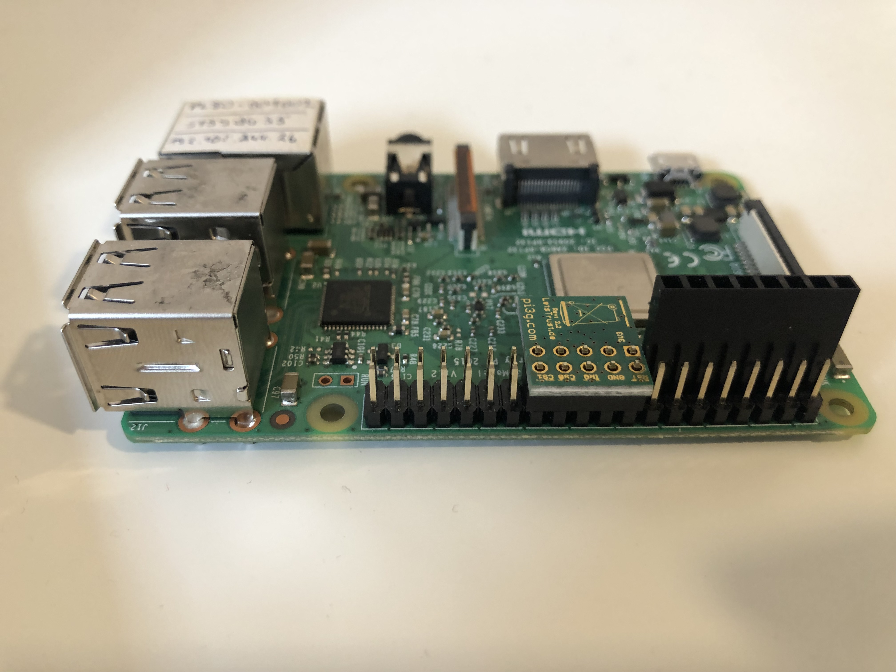
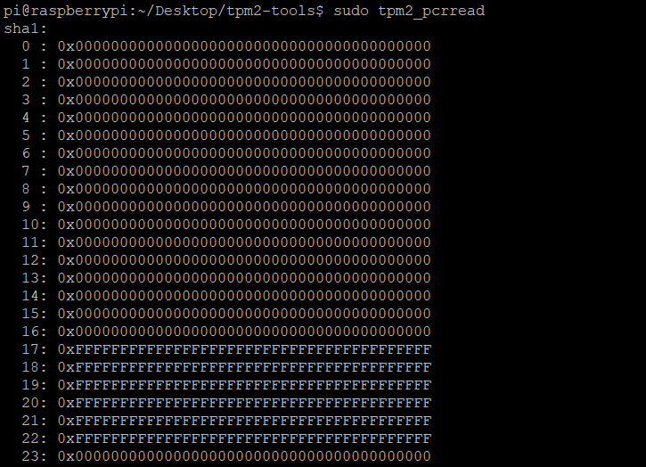
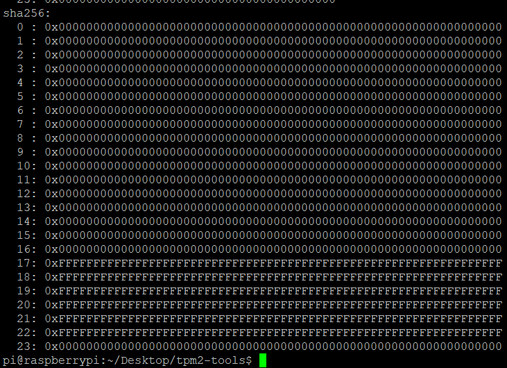
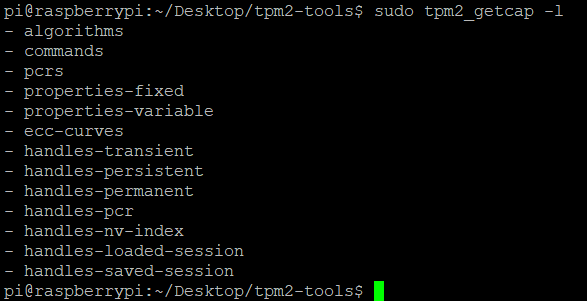
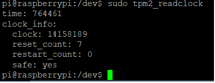

This chapter shows the TPM test procedure using the **Raspberry Pi 3** module.
### Lets Trust TPM Information

#### 1. Product contents
1. LetsTrust TPM Module (12.7 x 17.5 mm)

2. Female header (2x8 pin) 

#### 2. Install LetsTrust TPM module
**Installation precedure :** <br />

* First, insert the additional female header starting with pin 1 (on the far 
left side) into the Raspberry Pi GPIO header. The supplied female header helps 
to plug in the TPM module in the right position. After mounting it, could be 
removed. <br />
* Insert the Letstrust TPM module directly next to the additional female header.
 The TPM module will be installed starting with **pin 17**, facing downwards 
 with the chip and oriented towards the HDMI port. <br /><br />




The LetsTrust TPM module is also compatible with other Raspberry Pi modules.

**All connections should be done while the power supply is switched OFF!**
<br /><br />


#### 3. Usage examples
The best projects for the TPM module come from the community in which the 
Letstrust supplied the hardware. Already, several core software packages are 
available:

| Link  | Description |
|-------|-------------|
| [http://github.com/tpm2-software](http://github.com/tpm2-software) | Tools to use the TPM |
| [https://github.com/Infineon/eltt2](https://github.com/Infineon/eltt2)| ELTT2 Infineon Embedded Linux TPM Toolbox 2 for TPM 2.0 - test, diagnostics and essential changing of the Infineon TPM chip  p |
| [https://github.com/PaulKissinger/LetsTrust](https://github.com/PaulKissinger/LetsTrust) |Useful resources and script to get you started with the TPM and compilation/installation of the TPM 2.0 Tools.|

Application samples, documentation, and a lot of additional information from 
the community are available at [www.letsTrust.de](https://www.letsTrust.de).

To report your examples and develop applications send an e-mail at 
**<support@pi3g.com>** or **<info@letstrust.de>**. 

<!---## For check out the whole process, there was executed test using the 
##tpm_2 tools.

```console
git clone git@github.com:tpm2-software/tpm2-tools.git
```
The repository was downloaded into:
```txt
/Desktop/tpm2-tools
```
-->
### First, install the **tpm2-tools**
```console
sudo apt install tpm2_tools
```
After that you could run all the tools which are described at: [tpm2-tools
/man/](https://github.com/tpm2-software/tpm2-tools/tree/master/man)
For example: <br />

* Example 1:
```console
sudo tpm2_pcrread
```



* Example 2:
```console
sudo tpm2_getcap -l
```


* Example 3:
```console
sudo readclock
```


