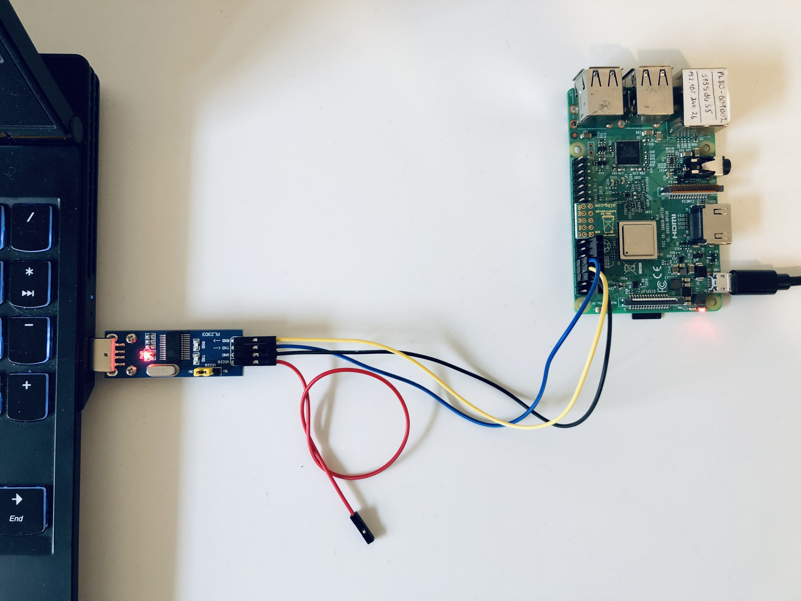
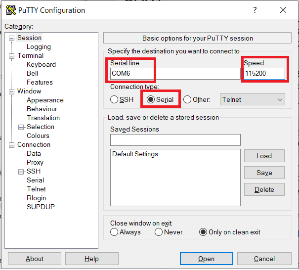
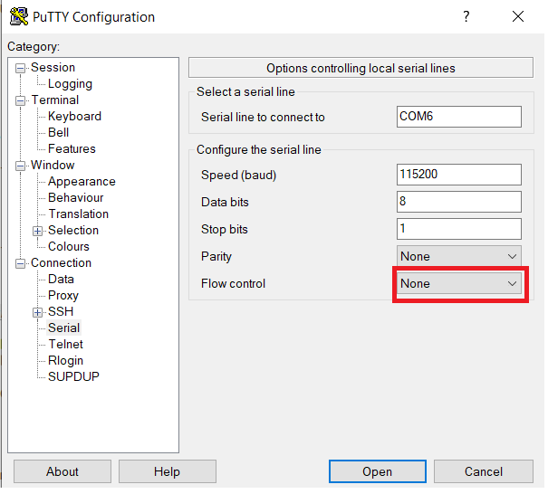

## Connecting Raspberry Pi 3 with Windows OS using USB/UART converter
For make this task necessary are:<br />

- [Raspberry Pi 3 Model B](https://www.raspberrypi.com/products/raspberry-pi-3
-model-b/)

- [USB/UART Converter](https://botland.com.pl/konwertery-usb-uart-rs232-rs485/
4501-konwerter-usb-uart-pl2303-wtyk-usb-waveshare-4037.html)

- [TPM module](https://pi3g.com/products/industrial/letstrust-tpm/)

- PC with Windows OS



## Guide

* The first step is Raspberry Pi OS installation using [Imager](https://www.
raspberrypi.com/software/) program. 
<br />Please choose: **Download for Windows**
<br />

* Please download the OS: [RPI OS](https://downloads.raspberrypi.org/raspios_
full_armhf/images/raspios_full_armhf-2021-11-08/2021-10-30-raspios-bullseye-
armhf-full.zip)

* Connect the SD card reader to the USB port and run the file flashing procedure
 via Imager software. 

* Find and edit **config.txt** file. Please make sure that after edit you have 
one more additional line as the line below:
```txt
enable_uart=1
```
*Recommended is to add the above line at the bottom of the config.txt file.* 
<br />
<br />

* After that plug uSD card into the Raspberry Pi socket. Make sure that your 
converter has the right voltage support! **3.3V** is recommended!


* Connect the USB/UART converter to the USB port at your PC. <br />


* Run [PuTTY](https://www.chiark.greenend.org.uk/~sgtatham/putty/latest.html).
* Set the parameters as below. <br />*Important is to choose the serial option, 
the right COM port and speed.* 






After that open the serial port and plug the power supply into your RPi. Now you 
will work in the terminal.

* Log into Raspberry Pi. The default login is: **pi** and password: 
**raspberry**.<br /><br />

## Configuration and activation under Raspbian
The LetsTrust TPM module is supported directly by Linux, starting with Kernel 
4.14.85. Please refer to [www.letsTrust.de](https://www.letsTrust.de) for 
further information. Update to the latest Raspbian Stretch and active the TPM 
as /dev/tpm0 using the following commands:
```console
$ sudo apt-get update && sudo apt-get upgrade
$ sudo nano /boot/config.txt
```
Necessary is to add these two lines at the bottom of the document:

```txt
dtparam=spi=on
dtoverlay=tpm-slb9670
```
```console
$ sudo reboot
```
To make sure that the initialization process was successful please check if you 
have available:
```txt
/dev/tpm0
```

