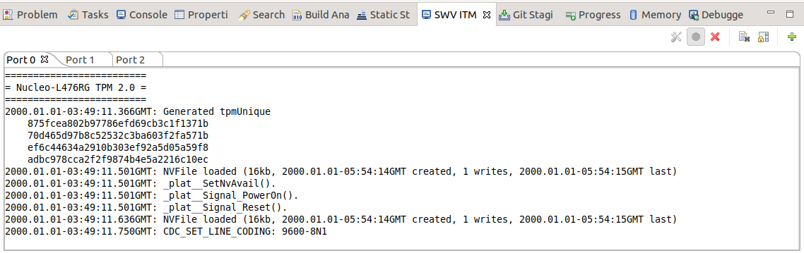

## Running

The project is using three communication interfaces to debug and talk to TPM core.

- TPM core communication is handled by STM32 USB CDC interface.
See `ms-tpm-20-ref/Samples/Nucleo-TPM/microUSB_Hookup.jpg`
- `printf` is forwarded to the integrated STLink VCOM.
- `fprintf(stderr, *)` could be received on port 0 of ITM SWV.
- `dbgPrint` uses port 1 of  ITM SWV.

### ITM trace configuration
For now, ITM trace output is available only through STM32CubeIDE. We are
planning to add this feature using command-line tools like `openocd` or
`STM32_Programmer_CLI`.

To view ITM output first you should enable SWV ITM console, by selecting it in
`Window -> Show View -> Other`.

Next thing is to start to debug the application and when it hits the first
breakpoint select `Configure trace` under SWV ITM console.


Select the first three channels and accept.


After that you should be ready to go, so just click `Start Trace` - red dot icon
and hit F8 to continue program execution.


Now you should see trace debug output like in the picture below.



### USB CDC configuration

On some platforms (Ubuntu in my case) '/dev/ACM*' ports automaticly receive AT
commands just after plugging USB cable.

As we are using raw data format to communicate with TPM device and STM32 CDC
port mount as /dev/ACM* device this could be problematic.

To stop receiving AT commands just disable ModemManager service with the
following command:

```
sudo systemctl disable ModemManager
```
