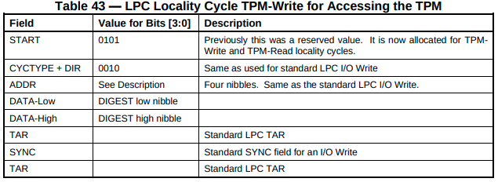
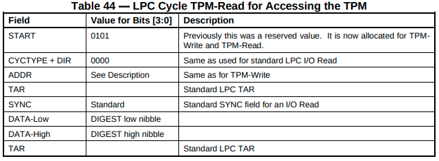
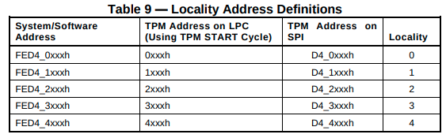
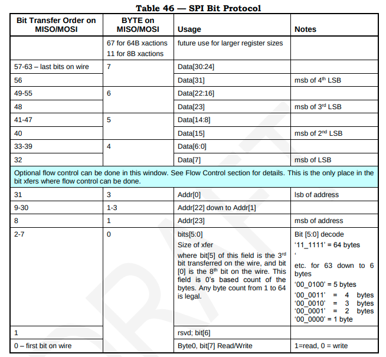

# TPM LPC/SPI interface

LPC and SPI has been described in
[PC Client Platform TPM profile](https://trustedcomputinggroup.org/wp-content/uploads/PC-Client-Specific-Platform-TPM-Profile-for-TPM-2p0-v1p05p_r14_pub.pdf).

## LPC

LPC has been described in section 7.3.

- TPM interrupts
  + TPM uses LPC SIRQ (also known as SERIRQ) for signaling interrupts.
  + Unfortunatelly, serialized interrupts are not described in Intel LPC
    specification.
    [LPC WikiPedia article](https://en.wikipedia.org/wiki/Low_Pin_Count) has
    some information available and
    [Serialized IRQ for PCI](https://web.archive.org/web/20071028030435/http://www.smsc.com/main/tools/papers/serirq60.doc).
  + The IRQ which TPM may trigger is configured by Host by writing
    to `TPM_INT_VECTOR_x` register (see Table 38).
- TPM uses specific read/write cycles for communication with Host
  + LPC protocol defines 2 fields (START and CYCTYPE, both 4-bit long) which
    determine LPC cycle type. TPM uses its own cycle type where START=0101
    always. CYCTYPE=0010 for TPM write cycle and CYCTYPE=0000 for TPM read
    cycle.
  + TPM **must** verify cycle type and ignore non-TPM cycles.
- LPC data transfer
  + Table 43 and 44 show LPC frame format
  
  
  + ADDR field contains 16-bit TPM register address. See Table 9 for details how
    TPM MMIO space maps to register address emitted on the bus.
    
  + It should be noted that LPC can transfer only a single data byte (DATA low
    and high fields). Please note that the lowest nibble (4 bits) are transfered
    first and then the highest 4 bits.
  + LPC has native flow control, see
  [Intel LPC specification](https://www.intel.com/content/dam/www/program/design/us/en/documents/low-pin-count-interface-specification.pdf)
  section `4.2.1.8` for details.

## SPI

SPI has been described in-depth in section 7.4.

- TPM interrupts
  + TPM must implement PIRQ# pin. See section 7.4.3.
  + PIRQ# is active-low, TPM connects PIRQ# to ground to trigger interrupt.
  + TPM **must not** implement an internal PIRQ# pull-up.
  + Prior to triggering interrupts TPM **must** set interrupt status registers
    accordingly.
  + TPM **must not** assert another interrupt until it receives TPM_EOI.
- Flow control
  + Contrary to LPC, SPI does not have native flow control. TPM flow control on
    SPI is a non-standard behaviour, not defined by SPI specification.
  + TPM may insert wait state to delay data transfer (from Host to TPM).
  + TPM **must** insert wait state when it's internal FIFO is full or accept the
    transaction.

    > The TPM, if it doesn’t insert a wait state at the designated point must
    > accept the transaction, if the transaction doesn’t cross a register
    > boundary. If the transaction crosses a register boundary, the TPM may
    > choose to accept all the data and discard the data that exceeds the size
    > limit for that register as long as doing so does not cause a change to the
    > state of any adjacent register.

  + Usually TPM is allowed to insert as many wait states (each wait state is 8
    clock cycles) as it wants, except during read of a few registers where it is
    allowed to insert only one wait cycle. TPM cannot insert more than 1 wait
    cycle for the following registers: TPM_ACCESS_x, TPM_STS_x,
    TPM_INTF_CAPABILITY, TPM_INT_ENABLE, TPM_INT_STATUS, TPM_INT_VECTOR,
    TPM_DID, TPM_VID.
  + TPM **must** insert wait state if Host attempts to write data while TPM is
    busy - Host should check TPM status register to see if TPM is ready.

    > For writes, the TPM is required to insert wait states if software
    > attempts to write data without waiting for the TPM to transition to the
    > Ready state.

- Data transmission (see section 7.4.6 for details)
  + TPM uses SPI mode 0 (CPHA=0, CPOL=0), no other modes are supported.
  + SPI packet is outlined in Table 48
  + Data transfer starts from the least significant byte and ends on the
    most significant byte.
  
  + The first bit transferred determines whether transaction is read or write.
  + This is followed by a single reserved bit.
  + This is followed by 6 bit length from 1 byte to 64 bytes. This is length of
    the data payload, excluding 32-bit header.
  + Length is followed by 24-bit register address, the highest byte is always
    0xD4. See Table 9 for details how TPM MMIO space maps to register address
    emitted on the bus.
    

## TPM register interface

According to section 6.3.1 Host may attempt to read less bytes than there
actually is in register, TPM must handle this, it must also handle read from the
middle of register, e.g. if we have a 32-bit register at 0x20, 1 byte read from
0x20 must yield the first byte of that register, read from 0x21 must yield the
second byte from that register.

Software must never attempt to cross register size in a same transfer. In case
of LPC this won't be noticed by TPM as all multi-byte LPC transfers are split
into multiple transfers, e.g. if hosts writes 0x11223344 to register 0x10 on LPC
it will appear as
- 0x44 write to 0x10
- 0x33 write to 0x11
- 0x22 write to 0x12
- 0x11 write to 0x13

Even if register boundary were crossed this doesn't make any difference for TPM.
In case of SPI data payload of a single transfer cannot be bigger than size of
register and cannot cross register boundary. Still, this must be handled, TPM
specification does not define clearly what the behaviour should be.

> For SPI, if a TPM receives an access request with a length that exceeds the
> size of the register specified in the transaction address:
> (...)
> b. Writes:
> The TPM SHALL update the register designated by the start address.
> The TPM MAY update additional, adjacent registers within the targeted
> address range.
> The TPM SHALL NOT change the state of adjacent registers if the writes to
> that register are dropped.
>
> The TPM SHOULD NOT abort (as defined in Section 6.5.1.1 Bus Aborts) an entire
> transaction that crosses a register boundary.

We choosed to write as many registers as possible, if register write is dropped
(such as when register is not present or read-only) bus abort is raised (see
section 6.5.1.1). This stops write on the register which triggered error and
further registers are not updated.

TPM must implement the following registers (non-exauhstive list):
- TPM_DID_VID_x - contains Vendor and Device ID of the TPM, see **Table 13** for
  details.
- TPM_RID_x - contains revision ID, see **Table 14 for details**.
- TPM_INTERFACE_ID_x - mandatory register, see **Table 15**.
- interrupt control/status registers
- other registers are required, **Table 19** for FIFO interface requirements.

## TPM commands

There are two interfaces for sending TPM commands and reading back responses,
one is CRB not covered here and another FIFO. See section 6.5.2 for details
about FIFO mode.

In FIFO mode command is written to `TPM_DATA_FIFO_x` register. Host writes
entire command packet to FIFO and triggers command execution by setting
`tpmGo` in the `TPM_STS` (see **Table 21**) register which triggers command
execution. When response is available TPM signals it by setting `dataAvail` bit
in status register. Host can now read response from `TPM_DATA_FIFO_x`.

There is also `TPM_XDATA_FIFO_x` register which allows for writes that span
multiple bytes, this is especially useful for SPI as it can send more than one
dword in a single packet. See section 6.3.1 for details.

> Unlike LPC, the SPI bus does not limit transfers to a single byte. The
> extended size data register (TPM_XDATA_FIFO_x) and CRB data buffer allow a
> single write to offset 0x0080h up to the maximum transfer size reported by
> TPM_INTF_Capability_x.DataTransferSizeSupport, without requiring Software to
> increment the address.

TPM is **required** to accept at least 1 byte transfers through
`TPM_XDATA_FIFO_x`

> The TPM SHALL accept transactions to offset 0x0080h that are of any length
> from 1 byte to the maximum supported length (as reported in the Interface
> Capability register, Section 6.5.2.7 Interface Capability).

According to **Table 12** `TPM_XDATA_FIFO_x` spans only a 4 byte region
(followed by reserved region), this raises doubts how big transfer should be
handled as usually address is increased after each byte. Until this is clarified
TPM should not report sizes bigger that 4 bytes in
`TPM_INTF_Capability_x.DataTransferSizeSupport`.
