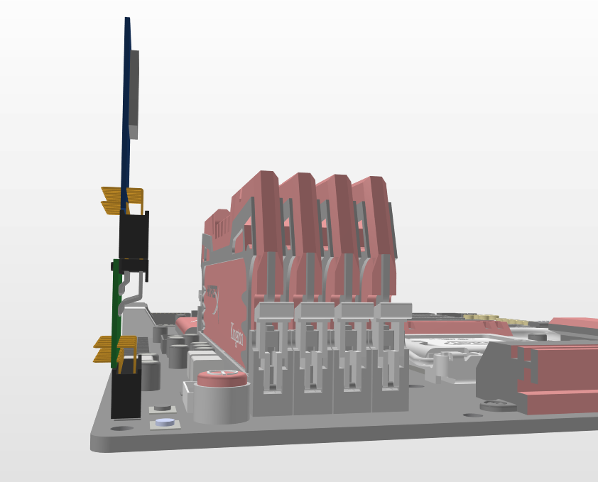

## The TPM concept
According to the many varied pinouts necessary was design the concept of TPM 
module which can fit the motherboard pinout. There was the consideration of 
two kinds of the interface (SPI and LPC). The whole setup would be made of two 
PCBs. One is the main PCB with the MCU and SPI or LPC configured socket and the 
second is the adapter that fits the motherboards pinouts.

## Concept of slim adapter
Because of limited space on the motherboard, we decided to design the slim 
variant of the TPM module. Dimensions are shown in the attached graphics below.
### The main module:

### The adapter:

### The assembly:

### An example of usage with motherboard:

Thanks for that design the widest element (connector that connects the whole 
design with motherboard socket) measures 5mm. That allowed to get slim contour. 
The length of the design is indicative and might be changed.
